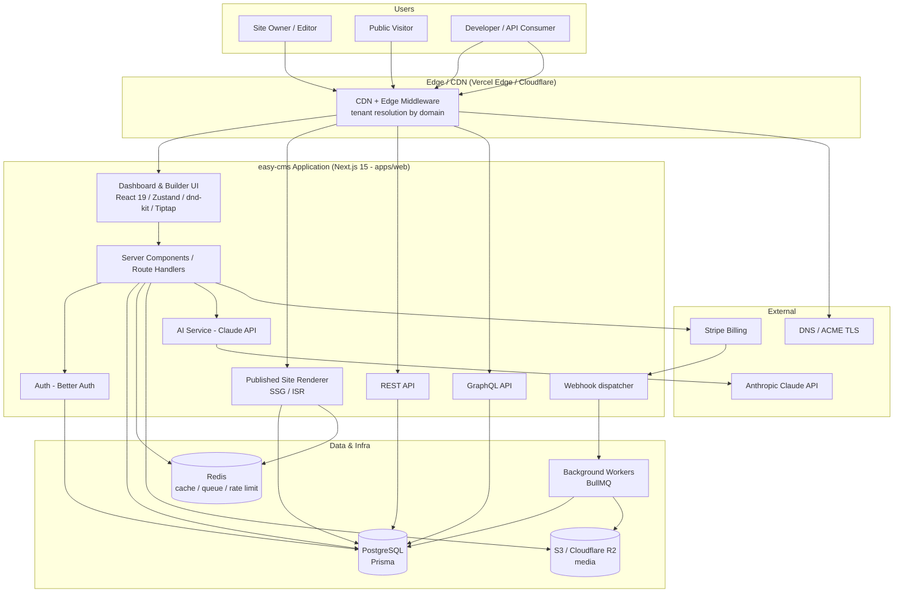
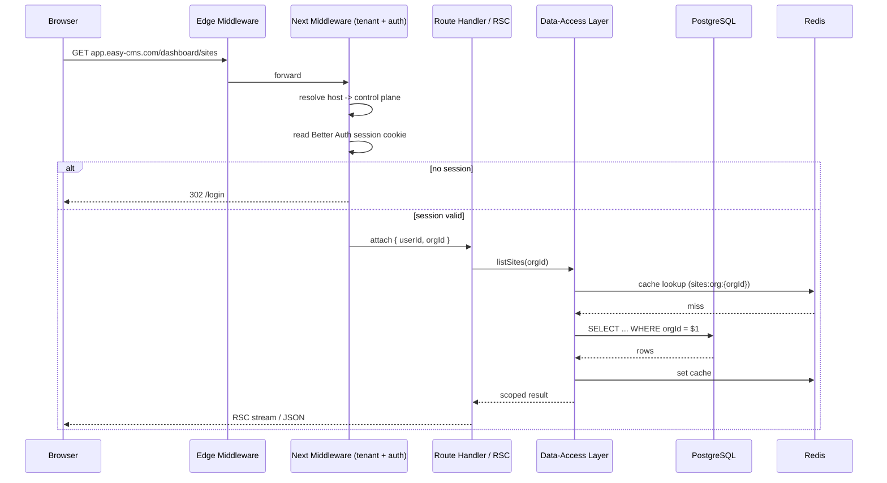
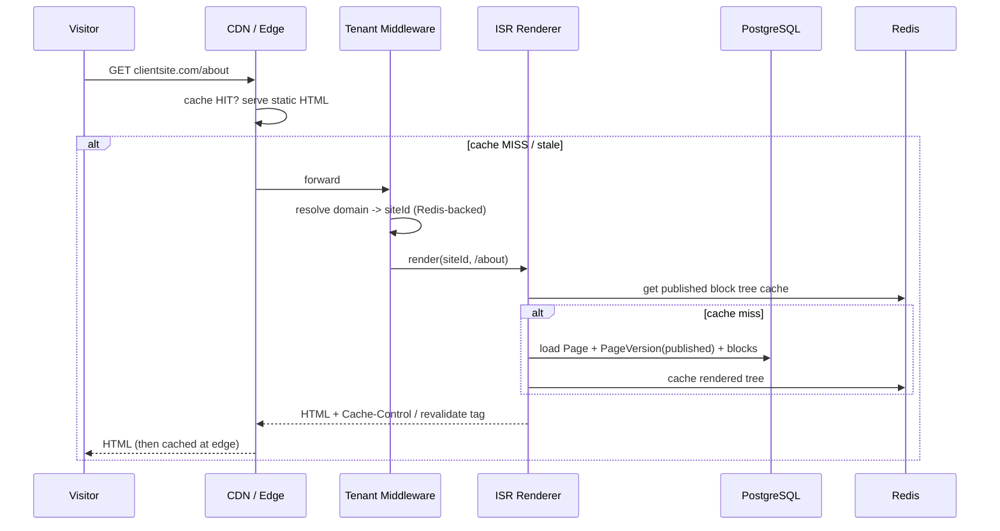
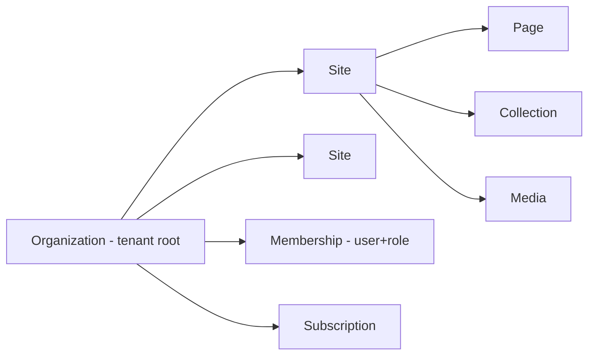
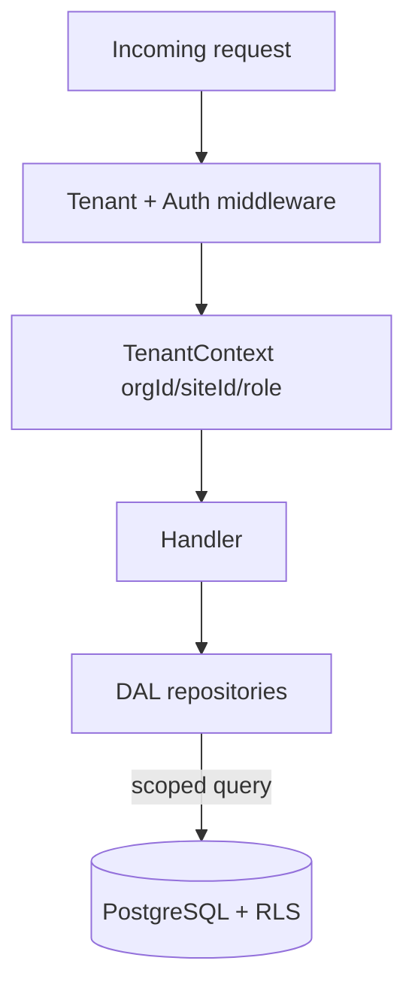
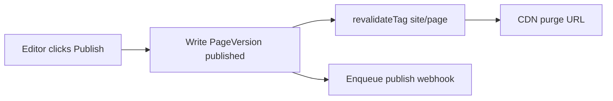
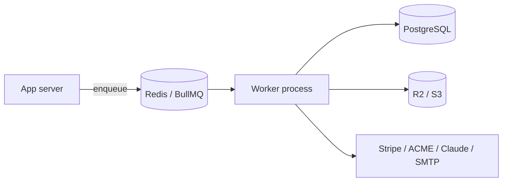

# easy-cms — System Architecture

> Document 02 of the easy-cms documentation set. See [README](./README.md) for the full index.

This document describes the system architecture for **easy-cms**: a multi-tenant SaaS website builder & headless CMS built on Next.js 15 (App Router) + React 19 + TypeScript, PostgreSQL + Prisma, Better Auth, Redis, S3/Cloudflare R2, and Stripe, deployed via Docker/Vercel/Railway.

---

## 1. Architectural Goals

| Goal | Approach |
|---|---|
| Strict tenant isolation | Shared DB, row-level scoping by `orgId` / `siteId`, enforced in a data-access layer |
| Fast published sites | SSG + ISR + CDN for published pages; dynamic only in the editor |
| Low editor latency | Zustand client store + optimistic updates + debounced autosave |
| Horizontal scalability | Stateless app servers, Redis for cache/queues, object storage for media |
| Clear separation | **Control plane** (dashboard/editor/API) vs **Delivery plane** (published sites) |

---

## 2. C4-ish Context & Container Diagram



---

## 3. Monorepo Structure (high level)

A Turborepo/pnpm monorepo. Full annotated tree is in [05-folder-structure.md](./05-folder-structure.md).

```
easy-cms/
├── apps/
│   └── web/              # Next.js 15 App Router app (dashboard, editor, renderer, APIs)
├── packages/
│   ├── db/               # Prisma schema, client, migrations, seed
│   ├── ui/               # shadcn/ui-based shared component library + design tokens
│   └── config/           # Shared config: tsconfig, eslint, tailwind preset, env schema
└── docs/                 # This documentation set
```

The `apps/web` boundary intentionally hosts both control plane and delivery plane; they are separated by **route groups and rendering strategy**, not by separate deployments (so they can later be split if scale demands).

---

## 4. Request Lifecycle

### 4.1 Dashboard / Builder request (authenticated control plane)



### 4.2 Published site request (delivery plane)



---

## 5. Multi-Tenancy Strategy

easy-cms uses a **shared database, shared schema** model with **row-level tenant scoping**. This is the simplest operationally for the target scale (many small tenants) and integrates cleanly with Prisma.

### 5.1 Tenancy hierarchy



- **Organization** is the billing & isolation root (the "tenant").
- **Site** belongs to exactly one Organization; almost every content row carries `siteId`.
- Org-level resources (members, billing, shared templates/themes) carry `orgId`.

### 5.2 Isolation enforcement (defense in depth)

1. **Middleware tenant resolution** — every request resolves a tenant context (`orgId`, and for delivery plane `siteId`) before reaching handlers.
2. **Data-Access Layer (DAL)** — *no handler queries Prisma directly*. All reads/writes go through repository functions that **require** an explicit tenant scope argument and inject `WHERE orgId = ?` / `WHERE siteId = ?`.
3. **PostgreSQL Row-Level Security (RLS)** — optional second layer: a per-request `SET app.current_org_id` with RLS policies on tenant tables, so a missing scope in code cannot leak data.
4. **Authorization** — RBAC checks (see [08-auth-architecture.md](./08-auth-architecture.md)) ensure the caller's membership grants access to the resolved tenant.



### 5.3 Tenant resolution by domain / subdomain

The Next.js middleware classifies the incoming `Host`:

| Host pattern | Plane | Resolution |
|---|---|---|
| `app.easy-cms.com` | Control plane | session → user → active org |
| `*.easy-cms.com` (e.g. `acme.easy-cms.com`) | Delivery plane | subdomain → `Site.subdomain` |
| Custom domain (e.g. `acme.com`) | Delivery plane | `Domain.hostname` lookup → `siteId` |

Domain → `siteId` mappings are cached in Redis (`domain:{host} -> siteId`) with a short TTL and explicit invalidation on domain change, so resolution is a single fast lookup at the edge.

---

## 6. Rendering Strategy

| Surface | Strategy | Why |
|---|---|---|
| Published site pages | **SSG + ISR** (`generateStaticParams` + `revalidate` + on-demand `revalidateTag`) | Fastest, cacheable, cheap |
| Published dynamic CMS listing/detail | **ISR** keyed by collection record updates | Fresh but cacheable |
| Builder/editor canvas | **Dynamic (client-rendered + RSC data)** | Needs live, per-edit state |
| Dashboard | **Dynamic / RSC** | Per-user, per-org data |
| Public APIs (REST/GraphQL) | **Dynamic route handlers** with Redis caching | Read-heavy, cache-friendly |

**Publish → invalidate flow:** when an editor publishes a page, the app writes a new `PageVersion(status=published)`, then calls `revalidateTag('site:{siteId}:page:{pageId}')` and purges the CDN/edge cache for affected URLs. Background jobs may pre-render high-traffic pages.



---

## 7. Caching Layers

| Layer | Tech | Contents | Invalidation |
|---|---|---|---|
| Edge/CDN | Vercel/Cloudflare | Rendered published HTML, static assets | ISR revalidate + tag purge on publish |
| Application data cache | Redis | Domain→site map, theme tokens, published block trees, API responses | Key delete on write |
| Session / rate-limit | Redis | Better Auth sessions (optional), rate-limit counters | TTL |
| Image CDN | R2/S3 + image optimizer | Responsive image variants | Content-addressed (immutable) |

Cache keys are always tenant-prefixed (`org:{orgId}:...`, `site:{siteId}:...`) so isolation extends to the cache.

---

## 8. Background Jobs

Implemented with **BullMQ on Redis**. Workers run as a separate process (same image, different entrypoint).

| Queue | Jobs |
|---|---|
| `publish` | Pre-render pages, warm CDN, generate sitemap |
| `media` | Image optimization, responsive variants, virus scan |
| `webhooks` | Deliver webhooks with retries + backoff |
| `email` | Verification, password reset, form notifications |
| `billing` | Reconcile Stripe usage, dunning |
| `ai` | Async AI generation (long blog drafts), usage metering |
| `domains` | ACME TLS issuance/renewal, DNS verification |



---

## 9. Technology Mapping

| Concern | Technology |
|---|---|
| Framework | Next.js 15 App Router, React 19, TypeScript |
| Styling/UI | TailwindCSS, shadcn/ui (in `packages/ui`) |
| Data | PostgreSQL + Prisma (`packages/db`) |
| Auth | Better Auth |
| Storage | S3 / Cloudflare R2 |
| Editor | dnd-kit (drag), Tiptap (rich text), Zustand (state) |
| Validation | Zod (shared schemas) |
| Cache/Queue | Redis + BullMQ |
| Billing | Stripe |
| AI | Anthropic Claude API (`claude-opus-4-8`, `claude-sonnet-4-6`) |
| Deploy | Docker, Vercel, Railway |

See the remaining documents for deep dives: [03-database-schema.md](./03-database-schema.md), [04-api-design.md](./04-api-design.md), [06-builder-architecture.md](./06-builder-architecture.md), [07-cms-architecture.md](./07-cms-architecture.md).
