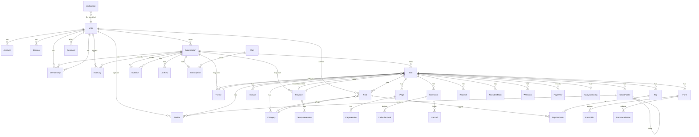
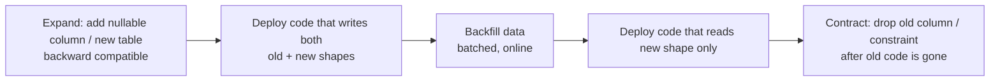

# easy-cms — Database Schema

> Document 03 of the easy-cms documentation set. See [README](./README.md) for the full index.

This document describes the **persistence layer** for **easy-cms**: the PostgreSQL data model expressed through Prisma (`packages/db/prisma/schema.prisma`). It covers the full entity-relationship model, per-domain field tables, the indexing strategy, and an operational playbook for migrations, optimization, partitioning, and tenant-scoped query discipline.

The schema follows the multi-tenancy strategy defined in [02-architecture.md](./02-architecture.md): a **shared database, shared schema** with **row-level isolation**. Every tenant-owned row carries an `organizationId` and/or `siteId` so that the data-access layer can inject scope predicates on every query. All primary keys are `cuid()` strings unless noted otherwise.

---

## 1. Entity-Relationship Diagram



> Cardinality legend: `||--o{` = one-to-many, `||--o|` = one-to-(zero-or-)one, `}o--o|` = many-to-(optional)one. Self-reference on `MediaFolder` models nested folders.

---

## 2. Domain Groups

The schema is organized into cohesive domain groups. Each group below lists the principal model(s) with a field table. JSON-typed columns are flagged because they are queried/indexed differently (see §4).

### 2.1 Auth / Identity

Backs **Better Auth** (see [08-auth-architecture.md](./08-auth-architecture.md)). `User` is the global identity root; `Account` holds credential/OAuth provider links; `Session` and `Verification` are auth machinery.

**User**

| Field | Type | Notes |
|---|---|---|
| `id` | String (cuid) | PK |
| `email` | String | unique, indexed |
| `emailVerified` | Boolean | default false |
| `name` | String? | |
| `image` | String? | avatar URL |
| `platformRole` | PlatformRole | `SUPER_ADMIN` \| `USER` |
| `createdAt` / `updatedAt` | DateTime | |

**Account**

| Field | Type | Notes |
|---|---|---|
| `id` | String (cuid) | PK |
| `userId` | String | FK → User, indexed |
| `providerId` | String | e.g. `credential`, `google` |
| `accountId` | String | provider-side id; `@@unique([providerId, accountId])` |
| `password` | String? | hashed (credential provider only) |
| `accessToken` / `refreshToken` / `idToken` | String? | OAuth tokens |
| `expiresAt` | DateTime? | |

**Session**

| Field | Type | Notes |
|---|---|---|
| `id` | String (cuid) | PK |
| `userId` | String | FK → User, indexed |
| `token` | String | session token |
| `expiresAt` | DateTime | |
| `ipAddress` / `userAgent` | String? | audit metadata |

**Verification**

| Field | Type | Notes |
|---|---|---|
| `id` | String (cuid) | PK |
| `identifier` | String | indexed (email/phone) |
| `value` | String | one-time token/code |
| `expiresAt` | DateTime | |

### 2.2 Tenancy / RBAC

`Organization` is the tenant root and billing boundary. `Membership` binds a `User` to an `Organization` with a `Role`. `Invitation` is the pending-membership flow. See [08-auth-architecture.md](./08-auth-architecture.md) for role semantics.

**Organization**

| Field | Type | Notes |
|---|---|---|
| `id` | String (cuid) | PK |
| `name` / `slug` | String | slug unique |
| `ownerId` | String | FK → User (`OrgOwner`), indexed |
| `createdAt` / `updatedAt` | DateTime | |

**Membership**

| Field | Type | Notes |
|---|---|---|
| `id` | String (cuid) | PK |
| `userId` | String | FK → User |
| `organizationId` | String | FK → Organization, indexed |
| `role` | Role | `ADMIN` \| `EDITOR` \| `AUTHOR` \| `MEMBER` |
| | | `@@unique([userId, organizationId])` |

**Invitation**

| Field | Type | Notes |
|---|---|---|
| `id` | String (cuid) | PK |
| `organizationId` | String | FK, indexed |
| `email` | String | indexed |
| `role` | Role | role to grant on accept |
| `status` | InviteStatus | `PENDING` \| `ACCEPTED` \| `REVOKED` \| `EXPIRED` |
| `token` | String | accept token |
| `expiresAt` | DateTime | |

### 2.3 Sites / Domains / Themes

A `Site` is the unit of published content; nearly every content row links back to it. `Domain` maps a hostname → site (delivery-plane resolution). `Theme` carries design tokens and may be **global** (`organizationId = null`).

**Site**

| Field | Type | Notes |
|---|---|---|
| `id` | String (cuid) | PK |
| `organizationId` | String | FK → Organization, indexed |
| `name` / `subdomain` | String | subdomain unique |
| `status` | SiteStatus | `DRAFT`\|`STAGING`\|`PUBLISHED`\|`SUSPENDED`, indexed |
| `themeId` | String? | FK → Theme (optional) |
| `templateId` | String? | FK → Template (optional) |
| `socialLinks` | **Json** | `{ twitter, instagram, … }` |
| `createdAt` / `updatedAt` | DateTime | |

**Domain**

| Field | Type | Notes |
|---|---|---|
| `id` | String (cuid) | PK |
| `siteId` | String | FK → Site, indexed |
| `hostname` | String | **unique** |
| `status` | DomainStatus | `PENDING`\|`VERIFYING`\|`ACTIVE`\|`FAILED` |
| `isPrimary` | Boolean | |
| `verifiedAt` | DateTime? | |

**Theme**

| Field | Type | Notes |
|---|---|---|
| `id` | String (cuid) | PK |
| `organizationId` | String? | **null = global theme**, indexed |
| `name` | String | |
| `tokens` | **Json** | color/typography/spacing design tokens |

### 2.4 Templates

`Template` is a marketplace/starter artifact; `organizationId = null` denotes a **global marketplace** template. Each `TemplateVersion` carries an immutable `manifest`.

**Template**

| Field | Type | Notes |
|---|---|---|
| `id` | String (cuid) | PK |
| `organizationId` | String? | null = global, indexed |
| `name` / `slug` | String | |
| `category` | TemplateCategory | indexed (`BUSINESS`…`LANDING_PAGE`) |
| `thumbnailUrl` | String? | |

**TemplateVersion**

| Field | Type | Notes |
|---|---|---|
| `id` | String (cuid) | PK |
| `templateId` | String | FK → Template |
| `version` | Int | `@@unique([templateId, version])` |
| `manifest` | **Json** | pages/blocks/assets definition |

### 2.5 Pages / Builder

A `Page` holds the live block tree; `PageVersion` is an immutable snapshot for draft/scheduled/published history (see [06-builder-architecture.md](./06-builder-architecture.md)). `ReusableBlock` is a shared block fragment.

**Page**

| Field | Type | Notes |
|---|---|---|
| `id` | String (cuid) | PK |
| `siteId` | String | FK → Site |
| `slug` | String | `@@unique([siteId, slug])` |
| `title` | String | |
| `type` | PageType | `HOME`\|`ABOUT`\|`CONTACT`\|`LANDING_PAGE`\|`BLOG`\|`CUSTOM` |
| `status` | ContentStatus | `DRAFT`\|`SCHEDULED`\|`PUBLISHED`\|`ARCHIVED` |
| `content` | **Json** | `BlockNode[]` array, default `"[]"` |
| `seo` | **Json** | meta title/description/OG |
| `publishedAt` | DateTime? | |

**PageVersion**

| Field | Type | Notes |
|---|---|---|
| `id` | String (cuid) | PK |
| `pageId` | String | FK → Page, indexed |
| `version` | Int | `@@unique([pageId, version])` |
| `content` | **Json** | snapshot of `BlockNode[]` |
| `status` | ContentStatus | |
| `createdAt` | DateTime | |

**ReusableBlock**

| Field | Type | Notes |
|---|---|---|
| `id` | String (cuid) | PK |
| `siteId` | String | FK → Site, indexed |
| `name` | String | |
| `content` | **Json** | block subtree |

### 2.6 CMS (Collections / Records)

The headless CMS: `Collection` is a content type, `CollectionField` defines its schema, `Record` is an entry. See [07-cms-architecture.md](./07-cms-architecture.md).

**Collection**

| Field | Type | Notes |
|---|---|---|
| `id` | String (cuid) | PK |
| `siteId` | String | FK → Site, indexed |
| `slug` | String | `@@unique([siteId, slug])` |
| `name` | String | |

**CollectionField**

| Field | Type | Notes |
|---|---|---|
| `id` | String (cuid) | PK |
| `collectionId` | String | FK → Collection, indexed |
| `key` | String | `@@unique([collectionId, key])` |
| `type` | FieldType | `TEXT`…`REFERENCE` (12 variants) |
| `config` | **Json** | validation/options/reference target |
| `required` | Boolean | |

**Record**

| Field | Type | Notes |
|---|---|---|
| `id` | String (cuid) | PK |
| `collectionId` | String | FK → Collection |
| `status` | ContentStatus | `@@index([collectionId, status])` |
| `data` | **Json** | field-keyed payload |
| `publishedAt` | DateTime? | |

### 2.7 Blog

`Post` is a first-class blog entry with Tiptap content; categorized via `Category` and tagged many-to-many via the `TagsOnPosts` join table.

**Post**

| Field | Type | Notes |
|---|---|---|
| `id` | String (cuid) | PK |
| `siteId` | String | FK → Site |
| `slug` | String | `@@unique([siteId, slug])` |
| `title` / `excerpt` | String | |
| `authorId` | String | FK → User |
| `categoryId` | String? | FK → Category, indexed |
| `status` | ContentStatus | `@@index([siteId, status])` |
| `content` | **Json** | Tiptap document JSON |
| `seo` | **Json** | |
| `publishedAt` | DateTime? | |

**Category** / **Tag**

| Field | Type | Notes |
|---|---|---|
| `id` | String (cuid) | PK |
| `siteId` | String | FK → Site |
| `slug` | String | `@@unique([siteId, slug])` (each) |
| `name` | String | |

**TagsOnPosts** — join table, `@@id([postId, tagId])`.

| Field | Type | Notes |
|---|---|---|
| `postId` | String | FK → Post |
| `tagId` | String | FK → Tag |

### 2.8 Media

`Media` rows reference objects in S3/R2; `MediaFolder` provides a (nestable) folder tree.

**Media**

| Field | Type | Notes |
|---|---|---|
| `id` | String (cuid) | PK |
| `siteId` | String | FK → Site |
| `folderId` | String? | FK → MediaFolder; `@@index([siteId, folderId])` |
| `uploaderId` | String? | FK → User |
| `type` | MediaType | `IMAGE`\|`VIDEO`\|`DOCUMENT` |
| `url` / `key` | String | object storage location |
| `width` / `height` / `size` | Int? | |

**MediaFolder**

| Field | Type | Notes |
|---|---|---|
| `id` | String (cuid) | PK |
| `siteId` | String | FK → Site, indexed |
| `parentId` | String? | self-FK (nesting) |
| `name` | String | |

### 2.9 Forms

`Form` defines a capture form; `FormField` its inputs; `FormSubmission` a captured response.

**Form**

| Field | Type | Notes |
|---|---|---|
| `id` | String (cuid) | PK |
| `siteId` | String | FK → Site, indexed |
| `name` | String | |
| `notifyEmails` | **String[]** | notification recipients |

**FormField**

| Field | Type | Notes |
|---|---|---|
| `id` | String (cuid) | PK |
| `formId` | String | FK → Form, indexed |
| `type` | FormFieldType | `TEXT`\|`EMAIL`\|`PHONE`\|`TEXTAREA`\|`SELECT`\|`RADIO`\|`CHECKBOX`\|`DATE`\|`FILE` |
| `label` / `key` | String | |
| `options` | **Json** | for select/radio/checkbox |
| `required` | Boolean | |

**FormSubmission**

| Field | Type | Notes |
|---|---|---|
| `id` | String (cuid) | PK |
| `formId` | String | FK → Form; `@@index([formId, createdAt])` |
| `data` | **Json** | submitted values |
| `meta` | **Json** | IP, UA, referrer, spam score |
| `createdAt` | DateTime | |

### 2.10 SEO / Redirects

SEO metadata lives inline as the `seo` Json column on `Page`, `PageVersion`, and `Post`. `Redirect` handles source→destination rewrites per site.

**Redirect**

| Field | Type | Notes |
|---|---|---|
| `id` | String (cuid) | PK |
| `siteId` | String | FK → Site, indexed |
| `source` | String | `@@unique([siteId, source])` |
| `destination` | String | |
| `statusCode` | Int | 301/302 |

### 2.11 Analytics

`AnalyticsConfig` (one per site) holds provider config; `PageView` is the high-volume event table (a partitioning candidate — see §5.5).

**AnalyticsConfig**

| Field | Type | Notes |
|---|---|---|
| `id` | String (cuid) | PK |
| `siteId` | String | FK → Site, **unique** |
| `provider` | String | e.g. `internal`, `plausible` |
| `config` | **Json** | provider settings |

**PageView**

| Field | Type | Notes |
|---|---|---|
| `id` | String (cuid) | PK |
| `siteId` | String | `@@index([siteId, createdAt])`, `@@index([siteId, path])` |
| `path` | String | request path |
| `referrer` / `country` / `device` | String? | |
| `createdAt` | DateTime | partition key candidate |

### 2.12 Billing

`Plan` is the catalog entry (mapped to a Stripe price); `Subscription` is the org's active plan (one per org). See Stripe integration in [02-architecture.md](./02-architecture.md).

**Plan**

| Field | Type | Notes |
|---|---|---|
| `id` | String (cuid) | PK |
| `name` | String | **unique** |
| `stripePriceId` | String | **unique** |
| `features` | **Json** | feature flags & limits |
| `priceCents` / `interval` | Int / String | |

**Subscription**

| Field | Type | Notes |
|---|---|---|
| `id` | String (cuid) | PK |
| `organizationId` | String | FK → Organization, **unique** |
| `planId` | String | FK → Plan |
| `stripeSubscriptionId` | String | **unique** |
| `status` | SubscriptionStatus | `TRIALING`\|`ACTIVE`\|`PAST_DUE`\|`CANCELED`\|`INCOMPLETE` |
| `currentPeriodEnd` | DateTime | |

### 2.13 API / Webhooks / Audit / Collaboration

**ApiKey** authenticates the public Content Delivery API (see [04-api-design.md](./04-api-design.md)); **Webhook** delivers events; **AuditLog** is the immutable change log; **Comment** powers collaboration.

**ApiKey**

| Field | Type | Notes |
|---|---|---|
| `id` | String (cuid) | PK |
| `organizationId` | String | FK → Organization, indexed |
| `name` | String | |
| `hashedKey` | String | **unique** (never store plaintext) |
| `prefix` | String | UI display (`ek_live_a1b2…`) |
| `scopes` | **String[]** | permission scopes |
| `expiresAt` / `revokedAt` | DateTime? | |

**Webhook**

| Field | Type | Notes |
|---|---|---|
| `id` | String (cuid) | PK |
| `siteId` | String | FK → Site, indexed |
| `url` | String | delivery endpoint |
| `events` | **String[]** | subscribed event names |
| `secret` | String | HMAC signing secret |

**AuditLog**

| Field | Type | Notes |
|---|---|---|
| `id` | String (cuid) | PK |
| `organizationId` | String | `@@index([organizationId, createdAt])` |
| `userId` | String? | `@@index([userId])` |
| `action` | String | e.g. `page.published` |
| `metadata` | **Json** | before/after diff, context |
| `createdAt` | DateTime | |

**Comment**

| Field | Type | Notes |
|---|---|---|
| `id` | String (cuid) | PK |
| `entityType` / `entityId` | String | polymorphic target; `@@index([entityType, entityId])` |
| `authorId` | String | FK → User |
| `body` | String | |
| `resolved` | Boolean | |

---

## 3. Enumerations

| Enum | Values |
|---|---|
| `PlatformRole` | `SUPER_ADMIN`, `USER` |
| `Role` | `ADMIN`, `EDITOR`, `AUTHOR`, `MEMBER` |
| `InviteStatus` | `PENDING`, `ACCEPTED`, `REVOKED`, `EXPIRED` |
| `SiteStatus` | `DRAFT`, `STAGING`, `PUBLISHED`, `SUSPENDED` |
| `DomainStatus` | `PENDING`, `VERIFYING`, `ACTIVE`, `FAILED` |
| `TemplateCategory` | `BUSINESS`, `PORTFOLIO`, `AGENCY`, `RESTAURANT`, `ECOMMERCE`, `PERSONAL`, `BLOG`, `LANDING_PAGE` |
| `PageType` | `HOME`, `ABOUT`, `CONTACT`, `LANDING_PAGE`, `BLOG`, `CUSTOM` |
| `ContentStatus` | `DRAFT`, `SCHEDULED`, `PUBLISHED`, `ARCHIVED` |
| `FieldType` | `TEXT`, `TEXTAREA`, `RICH_TEXT`, `NUMBER`, `BOOLEAN`, `DATE`, `IMAGE`, `GALLERY`, `JSON`, `SELECT`, `MULTI_SELECT`, `REFERENCE` |
| `MediaType` | `IMAGE`, `VIDEO`, `DOCUMENT` |
| `FormFieldType` | `TEXT`, `EMAIL`, `PHONE`, `TEXTAREA`, `SELECT`, `RADIO`, `CHECKBOX`, `DATE`, `FILE` |
| `SubscriptionStatus` | `TRIALING`, `ACTIVE`, `PAST_DUE`, `CANCELED`, `INCOMPLETE` |

---

## 4. Indexing Strategy

The schema's `@@index` / `@@unique` declarations exist for one of three reasons: **(a)** enforce a tenant-scoped uniqueness invariant, **(b)** accelerate the hot tenant-scoping predicate, or **(c)** support a frequent sort/filter. The table below enumerates every index in the schema and its rationale.

| Model | Index / Constraint | Type | Why it exists |
|---|---|---|---|
| User | `@@index([email])` | index | login & lookup by email |
| Account | `@@unique([providerId, accountId])` | unique | one account per provider identity |
| Account | `@@index([userId])` | index | list a user's linked accounts |
| Session | `@@index([userId])` | index | validate/list sessions per user |
| Verification | `@@index([identifier])` | index | look up tokens by email/phone |
| Organization | `@@index([ownerId])` | index | "orgs I own" queries |
| Membership | `@@unique([userId, organizationId])` | unique | a user joins an org at most once |
| Membership | `@@index([organizationId])` | index | list members of an org |
| Invitation | `@@index([organizationId])` | index | list pending invites per org |
| Invitation | `@@index([email])` | index | "my invitations" by email |
| Site | `@@index([organizationId])` | index | tenant-scoped site listing |
| Site | `@@index([status])` | index | filter published/suspended sites |
| Domain | `hostname @unique` | unique | global hostname → one site |
| Domain | `@@index([siteId])` | index | list a site's domains |
| Theme | `@@index([organizationId])` | index | org themes + global (null) themes |
| Template | `@@index([category])` | index | marketplace browse by category |
| Template | `@@index([organizationId])` | index | org-owned vs global templates |
| TemplateVersion | `@@unique([templateId, version])` | unique | one row per version number |
| Page | `@@unique([siteId, slug])` | unique | slug unique within a site |
| Page | `@@index([siteId, status])` | index | render published pages fast |
| PageVersion | `@@unique([pageId, version])` | unique | monotonic version per page |
| PageVersion | `@@index([pageId])` | index | version history listing |
| ReusableBlock | `@@index([siteId])` | index | site-scoped block library |
| Collection | `@@unique([siteId, slug])` | unique | collection slug unique per site |
| Collection | `@@index([siteId])` | index | list collections of a site |
| CollectionField | `@@unique([collectionId, key])` | unique | field key unique per collection |
| CollectionField | `@@index([collectionId])` | index | load a collection's schema |
| Record | `@@index([collectionId, status])` | index | published records per collection |
| Post | `@@unique([siteId, slug])` | unique | post slug unique per site |
| Post | `@@index([siteId, status])` | index | published-post listing |
| Post | `@@index([categoryId])` | index | posts by category |
| Category | `@@unique([siteId, slug])` | unique | category slug unique per site |
| Tag | `@@unique([siteId, slug])` | unique | tag slug unique per site |
| TagsOnPosts | `@@id([postId, tagId])` | composite PK | dedupe post↔tag pairs |
| MediaFolder | `@@index([siteId])` | index | folder tree per site |
| Media | `@@index([siteId, folderId])` | index | browse media by folder |
| Form | `@@index([siteId])` | index | list forms of a site |
| FormField | `@@index([formId])` | index | load a form's fields |
| FormSubmission | `@@index([formId, createdAt])` | index | recent submissions per form |
| Redirect | `@@unique([siteId, source])` | unique | one rule per source path |
| Redirect | `@@index([siteId])` | index | load a site's redirect map |
| AnalyticsConfig | `siteId @unique` | unique | one config per site |
| PageView | `@@index([siteId, createdAt])` | index | time-series analytics queries |
| PageView | `@@index([siteId, path])` | index | top-pages aggregation |
| Plan | `name @unique`, `stripePriceId @unique` | unique | catalog + Stripe mapping |
| Subscription | `organizationId @unique` | unique | one active subscription per org |
| Subscription | `stripeSubscriptionId @unique` | unique | Stripe ↔ local mapping |
| ApiKey | `hashedKey @unique` | unique | constant-time key lookup |
| ApiKey | `@@index([organizationId])` | index | list keys per org |
| Webhook | `@@index([siteId])` | index | dispatch lookup per site |
| AuditLog | `@@index([organizationId, createdAt])` | index | paginated audit timeline |
| AuditLog | `@@index([userId])` | index | actions by user |
| Comment | `@@index([entityType, entityId])` | index | threads for an entity |

---

## 5. Optimization & Migration Strategy

### 5.1 `migrate dev` vs `migrate deploy`

| Command | Environment | Behavior |
|---|---|---|
| `prisma migrate dev` | local / CI shadow DB | Diffs schema, **creates** a new migration, runs it, regenerates the client. May reset the DB on drift. **Never run in production.** |
| `prisma migrate deploy` | staging / production | Applies **already-committed** migrations in order, idempotently. No schema diffing, no resets. This is the only command run against production. |

Migrations are committed to `packages/db/prisma/migrations/` and reviewed like code. CI runs `migrate deploy` against a disposable database to assert that the migration set applies cleanly from empty.

### 5.2 Zero-downtime migrations — expand / contract

Because app servers are stateless and rolled gradually (see [02-architecture.md](./02-architecture.md)), schema changes must be **backward-compatible with the currently-running code**. We use the **expand/contract** pattern: never break a column in a single deploy.



Rules of thumb:

- **Additive first.** Add columns as nullable or with a default; add new tables/indexes concurrently.
- **No rename in place.** A rename = add new + backfill + switch reads + drop old, across deploys.
- **Build indexes concurrently.** Prisma migrations emit plain `CREATE INDEX`; for large tables, hand-edit the migration SQL to `CREATE INDEX CONCURRENTLY` (outside a transaction) to avoid table locks.
- **Contract last.** Destructive steps (drop column, add `NOT NULL`, tighten constraints) only ship once no running code depends on the old shape.

### 5.3 Partial indexes

Most hot reads target **published** content only. Partial indexes shrink the index and speed those scans. Prisma cannot express a `WHERE` predicate on an index, so these are added via raw SQL in a migration:

```sql
-- Only index published pages (the delivery-plane hot path)
CREATE INDEX CONCURRENTLY idx_page_published
  ON "Page" ("siteId", "slug")
  WHERE "status" = 'PUBLISHED';

-- Published records for a collection
CREATE INDEX CONCURRENTLY idx_record_published
  ON "Record" ("collectionId")
  WHERE "status" = 'PUBLISHED';

-- Active, non-revoked API keys
CREATE INDEX CONCURRENTLY idx_apikey_active
  ON "ApiKey" ("organizationId")
  WHERE "revokedAt" IS NULL;
```

### 5.4 JSON GIN indexes

`Page.content`, `Record.data`, and `FormSubmission.data` are queried by JSON containment / key existence. PostgreSQL's `jsonb` GIN indexes accelerate `@>`, `?`, and path operators. Prisma cannot declare a GIN index, so we add them via raw SQL:

```sql
-- Containment/path queries over record payloads
CREATE INDEX CONCURRENTLY idx_record_data_gin
  ON "Record" USING GIN ("data" jsonb_path_ops);

-- Block-tree queries (e.g. "pages using block type X")
CREATE INDEX CONCURRENTLY idx_page_content_gin
  ON "Page" USING GIN ("content");

-- Submission search by field value
CREATE INDEX CONCURRENTLY idx_formsubmission_data_gin
  ON "FormSubmission" USING GIN ("data" jsonb_path_ops);
```

> `jsonb_path_ops` is smaller/faster when you only need containment (`@>`); the default `jsonb_ops` is used when key-existence (`?`) queries are also needed.

### 5.5 Partitioning `PageView` by time

`PageView` is append-heavy and queried by time range. We declare it as a **range-partitioned** table on `createdAt`, with **monthly** partitions, so old data can be detached/dropped cheaply and queries prune to the relevant months.

```sql
-- One-time conversion (in a migration); future months pre-created by a job
CREATE TABLE "PageView" (
  /* ...columns... */
  "createdAt" timestamptz NOT NULL
) PARTITION BY RANGE ("createdAt");

CREATE TABLE "PageView_2026_06" PARTITION OF "PageView"
  FOR VALUES FROM ('2026-06-01') TO ('2026-07-01');
CREATE TABLE "PageView_2026_07" PARTITION OF "PageView"
  FOR VALUES FROM ('2026-07-01') TO ('2026-08-01');
```

A `domains`/maintenance worker (see the BullMQ queues in [02-architecture.md](./02-architecture.md)) pre-creates next month's partition and detaches partitions older than the retention window. The `@@index([siteId, createdAt])` is created **per partition**.

### 5.6 Connection pooling

Serverless/edge invocations open many short-lived connections, which Postgres handles poorly. We front the database with **PgBouncer in transaction-pooling mode**:

- Prisma connects to PgBouncer, not directly to Postgres.
- `DATABASE_URL` carries `?pgbouncer=true&connection_limit=1` so Prisma disables prepared-statement caching that transaction pooling cannot support.
- A separate **direct** URL (`DIRECT_URL`) bypasses the pooler for `migrate deploy`, which needs a session-level connection.

### 5.7 Tenant-scoping query discipline

Indexing only pays off if every query carries the tenant predicate. This is enforced structurally (see [02-architecture.md §5.2](./02-architecture.md) and [09-security.md](./09-security.md)):

- **No handler queries Prisma directly.** All access goes through repository functions in `packages/db` that require an explicit `organizationId` / `siteId` argument and inject it into the `where` clause.
- **Composite indexes lead with the tenant key** (`[siteId, …]`, `[organizationId, …]`) so the scope predicate is always index-supported.
- **Optional RLS** (`SET app.current_org_id` + policies) provides a database-level backstop so a missing scope in code cannot leak cross-tenant rows.
- **Cache keys are tenant-prefixed** so the Redis layer inherits the same isolation.

See [04-api-design.md](./04-api-design.md) for how these models are exposed over REST, the public Content Delivery API, and GraphQL.
