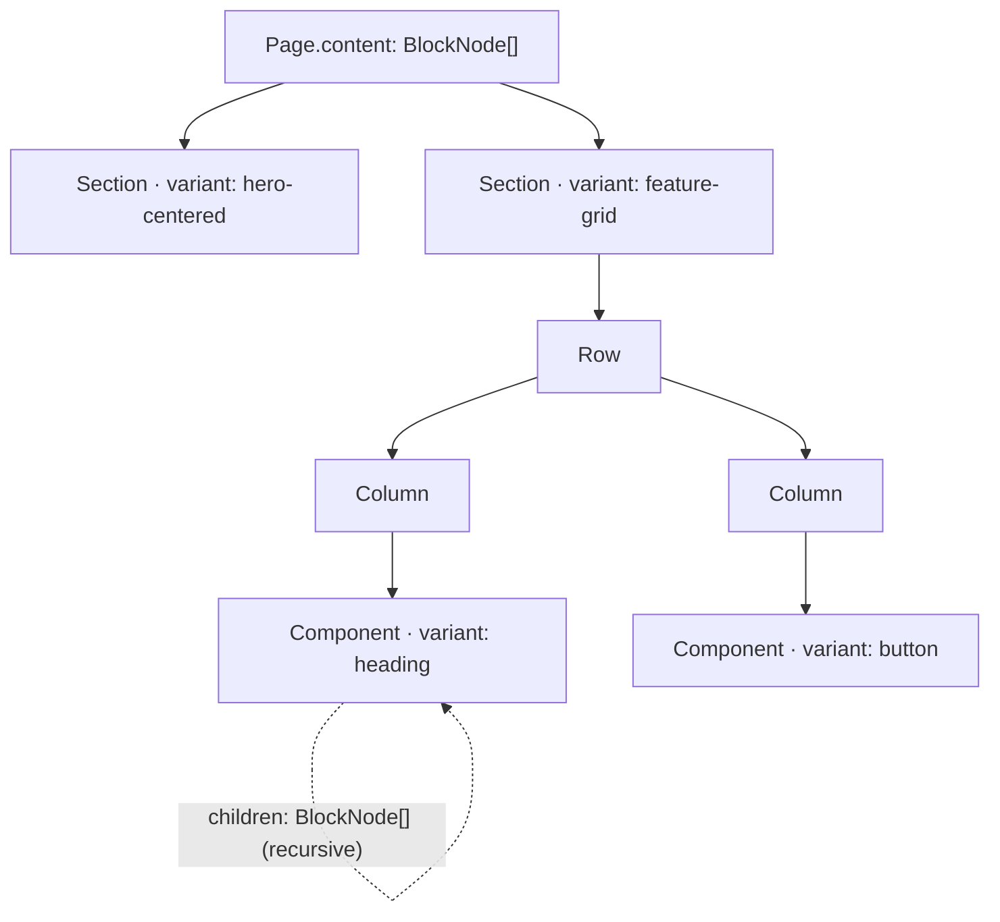
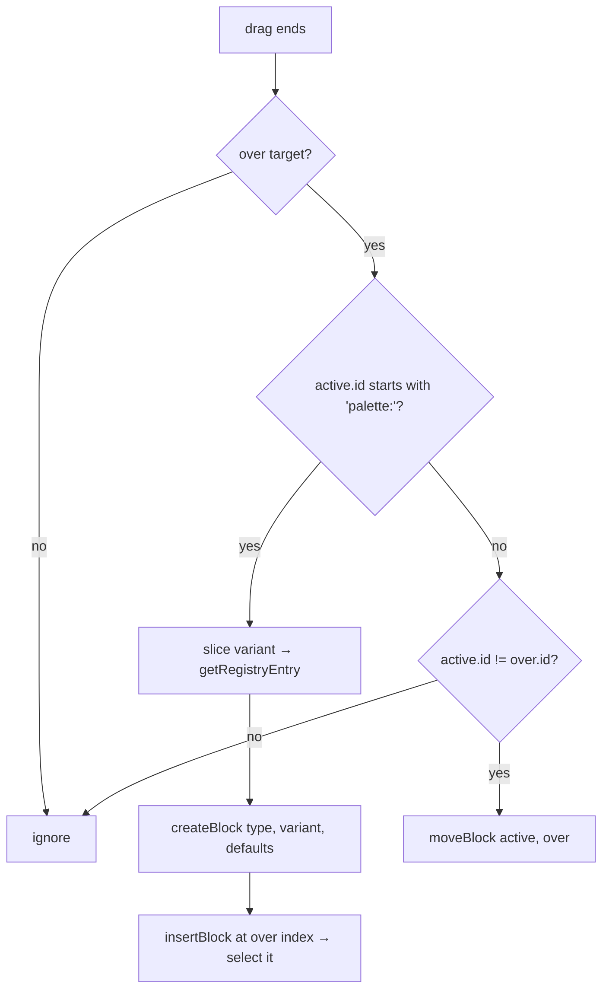
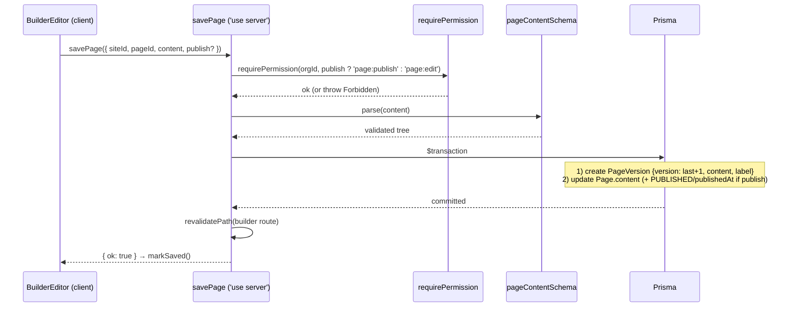
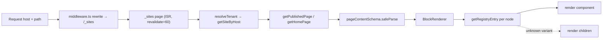

# easy-cms — Builder Architecture

> Document 06 of the easy-cms documentation set. See [README](./README.md) for the full index.

This document specifies the **visual, drag-and-drop website builder**: the data
model for a page, the component registry that maps data to UI, the drag-and-drop
mechanics (dnd-kit), the editor state machine (Zustand with undo/redo and
autosave), how saves become versioned snapshots, and how the same tree is
rendered both in the editor and on the published site.

It pairs with [Folder Structure](./05-folder-structure.md) (where each file
lives), the [Database Schema](./03-database-schema.md) (the `Page`,
`PageVersion`, and `ReusableBlock` models), the [CMS Architecture](./07-cms-architecture.md)
(content lifecycle and publishing), and the [Component Library](./12-component-library.md)
(the full per-variant prop/inspector catalog — only summarized here).

---

## 1. The block tree data model

A page's content is **not** HTML or a proprietary blob — it is a JSON **array of
recursive block nodes**. The canonical type and schema live in
`packages/core/src/builder.ts` so they are shared by the editor and the
renderer.

### 1.1 The `BlockNode` type

```ts
// packages/core/src/builder.ts (summary)
export const BREAKPOINTS = ['desktop', 'tablet', 'mobile'] as const;
export type Breakpoint = (typeof BREAKPOINTS)[number];

type BlockNode = {
  id: string;                          // "blk_<random>"
  type: string;                        // "section" | "row" | "column" | "component"
  variant?: string;                    // registry key, e.g. "hero-centered", "button"
  props: Record<string, unknown>;      // content/config consumed by the render component
  style?: ResponsiveStyle;             // optional per-breakpoint style overrides
  visibility?: { desktop; tablet; mobile: boolean };  // default true each
  animation?: { type; duration; delay };              // enter animation
  children: BlockNode[];               // recursive — arbitrary nesting
};

// Zod (recursive via z.lazy so it can reference itself):
export const blockNodeSchema: z.ZodType<BlockNode, z.ZodTypeDef, unknown> = z.lazy(() =>
  z.object({
    id: z.string(),
    type: z.string(),
    variant: z.string().optional(),
    props: z.record(z.any()),
    style: responsiveStyleSchema.optional(),       // { desktop?, tablet?, mobile? }: record
    visibility: visibilitySchema.optional(),       // booleans, default true
    animation: animationSchema.optional(),         // type enum, duration 300, delay 0
    children: z.array(blockNodeSchema),
  }),
);

export const pageContentSchema = z.array(blockNodeSchema);
export type PageContent = z.infer<typeof pageContentSchema>;

export function createBlock(type, variant, props = {}): BlockNode {
  return { id: `blk_${Math.random().toString(36).slice(2, 10)}`, type, variant, props, children: [] };
}
```

Supporting sub-schemas:

- `responsiveStyleSchema` — optional `desktop` / `tablet` / `mobile` records of
  arbitrary style values (per-breakpoint overrides).
- `visibilitySchema` — `desktop` / `tablet` / `mobile` booleans, each defaulting
  to `true`.
- `animationSchema` — `type` enum `['none','fade','slide-up','slide-in','zoom']`
  (default `none`), `duration` (default `300`), `delay` (default `0`).

### 1.2 A full node, as JSON

```jsonc
{
  "id": "blk_h3k9zp2a",
  "type": "section",            // section | row | column | component
  "variant": "hero-centered",   // looked up in the component REGISTRY
  "props": {
    "heading": "Build sites without code",
    "subheading": "Drag, drop, publish.",
    "ctaLabel": "Get started",
    "ctaHref": "/signup"
  },
  "style": {                    // per-breakpoint style overrides (optional)
    "desktop": { "paddingY": "6rem", "textAlign": "center" },
    "mobile":  { "paddingY": "3rem" }
  },
  "visibility": {               // hide on specific breakpoints (default: all true)
    "desktop": true,
    "tablet": true,
    "mobile": false
  },
  "animation": {                // enter animation (optional)
    "type": "fade",
    "duration": 400,
    "delay": 0
  },
  "children": [
    {
      "id": "blk_btn0091x",
      "type": "component",
      "variant": "button",
      "props": { "label": "Learn more", "href": "/about" },
      "children": []
    }
  ]
}
```

### 1.3 The conceptual hierarchy

Conceptually the tree is **Page → Section[] → Row[] → Column[] → Component[]**,
which maps naturally onto a CSS layout (full-width sections containing rows of
columns containing leaf components). But `BlockNode.children` is recursive and
`type`/`variant` are plain strings, so the data model imposes **no fixed depth or
taxonomy** — arbitrary nesting is allowed and new block kinds are introduced
purely by registering a `variant` (see §2), never by changing the schema.



> In the current implementation the canvas treats **top-level sections** as the
> primary sortable unit; rows/columns are expressed through section components'
> own props/children. The schema fully supports deeper structural nodes for
> future layout primitives.

---

## 2. The component registry

The bridge between data (`variant` strings) and UI (React components) is the
**registry** in `apps/web/src/components/builder/registry.tsx`. It is a single
source of truth consumed by the palette, canvas, inspector, and renderer.

```ts
export interface InspectorField {
  key: string;
  label: string;
  type: 'text' | 'textarea' | 'url' | 'number' | 'image' | 'select' | 'json';
  options?: { label: string; value: string }[];   // for 'select'
  placeholder?: string;
}

export interface RegistryEntry {
  variant: string;
  label: string;
  category: 'hero' | 'text' | 'media' | 'content' | 'business' | 'marketing' | 'blog' | 'component';
  type: 'section' | 'component';
  render: BlockComponent;                 // (props: { node, editing? }) => JSX
  defaults: Record<string, unknown>;      // props applied when dropped onto the canvas
  inspector: InspectorField[];            // fields shown in the right-hand panel
}

export const REGISTRY: Record<string, RegistryEntry> = { /* … */ };
export const PALETTE = Object.values(REGISTRY);
export function getRegistryEntry(variant?: string): RegistryEntry | undefined;
```

Each entry declares how a block looks (`render`), what it starts with
(`defaults`), and how it is edited (`inspector`). Adding a block = adding an
entry; no other code changes (see [Folder Structure §8](./05-folder-structure.md#8-where-new-code-goes)).

### 2.1 Inspector field types

The inspector (`inspector.tsx`) renders an editor for each `InspectorField`
based on its `type`:

| `type` | Editor rendered | Notes |
|---|---|---|
| `text` | single-line `<input>` | default text control |
| `textarea` | multi-line `<textarea>` | 4 rows |
| `url` | text input | links (`ctaHref`, `href`) |
| `number` | numeric input | value coerced with `Number()` |
| `image` | text input (URL) | image source; integrates with media in later phases |
| `select` | `<select>` of `options[]` | e.g. heading `level` |
| `json` | JSON `<textarea>`, committed on blur if valid | for structured arrays/objects (features, plans, items) |

Edits flow through `updateProps(blockId, { [key]: value })` on the store, which
records undo history and marks the page dirty.

### 2.2 Implemented variants (summary)

**Sections** (`type: 'section'`): `hero-centered`, `hero-split`, `rich-text`,
`feature-grid`, `cta`, `testimonials`, `pricing`, `faq`, `stats`.
**Components** (`type: 'component'`): `button`, `heading`, `image`.

These are grouped in the palette by `category` (`hero`, `text`, `media`,
`content`, `business`, `marketing`, `blog`, `component`). The full per-variant
prop and inspector breakdown is maintained in the
[Component Library](./12-component-library.md); this document only summarizes.

---

## 3. Drag-and-drop with dnd-kit

The editor shell (`editor.tsx`) wraps the palette **and** the canvas in a
**single `DndContext`**, so a drag can begin in the palette and end on the
canvas. A `PointerSensor` with `activationConstraint: { distance: 4 }` prevents
accidental drags from simple clicks (clicks select; a 4px move starts a drag).

Two kinds of draggables share that context, distinguished by their `id`:

- **Palette items** (`palette.tsx`) register `useDraggable({ id: 'palette:' + variant })`.
  The **`palette:` prefix** is the signal that a drop should *create a new
  block*.
- **Canvas sections** (`canvas.tsx`) register `useSortable({ id: node.id })`
  inside a `SortableContext` (`verticalListSortingStrategy`) keyed by the node
  ids. A drop here *reorders* existing top-level sections.

`handleDragEnd` branches on the active id:

```ts
function handleDragEnd({ active, over }: DragEndEvent) {
  if (!over) return;
  const activeId = String(active.id);

  if (activeId.startsWith('palette:')) {            // NEW block
    const variant = activeId.slice('palette:'.length);
    const entry = getRegistryEntry(variant);
    if (!entry) return;
    const block = createBlock(entry.type, variant, { ...entry.defaults });
    const overIndex = content.findIndex((n) => n.id === over.id);
    insertBlock(block, overIndex === -1 ? undefined : overIndex);
    return;
  }

  if (activeId !== over.id) moveBlock(activeId, String(over.id));  // REORDER
}
```



The canvas renders each section through its **real registry component** with the
`editing` prop, wrapped in a selection outline and a drag handle. This is what
makes the builder true WYSIWYG: the editor and the published page run the same
component code (§7). When `content` is empty, the canvas shows a prompt to drag
or click a block.

---

## 4. The editor store: state, mutations, undo/redo

Editor state is a Zustand store, `useEditor`, in
`apps/web/src/lib/store/editor.ts`. It is the single owner of the in-progress
tree and the history stacks.

```ts
interface EditorState {
  content: PageContent;     // the live tree being edited
  past: PageContent[];      // undo stack (older snapshots)
  future: PageContent[];    // redo stack
  selectedId: string | null;
  breakpoint: Breakpoint;   // 'desktop' | 'tablet' | 'mobile'
  dirty: boolean;           // unsaved changes pending → triggers autosave
  // actions ↓
}
const HISTORY_LIMIT = 50;
```

**Snapshot history model.** Undo/redo is implemented with **immutable
snapshots**, not command objects. Every content-changing action funnels through
`setContent(next)`, which pushes the *previous* tree onto `past` (sliced to the
last `HISTORY_LIMIT = 50`), clears `future`, and sets `dirty = true`:

```ts
setContent: (next) => set((s) => ({
  content: next,
  past: [...s.past, s.content].slice(-HISTORY_LIMIT),
  future: [],
  dirty: true,
})),
```

`undo()` pops `past` → current moves to `future`; `redo()` pops `future` →
current moves to `past`. Both mark the page dirty so the result is autosaved.

**Mutating actions** (all built on `setContent`, all recursive over `children`
via the helpers `replaceNode` / `removeNode` / `findNode` / `cloneWithNewIds`):

| Action | Effect |
|---|---|
| `init(content)` | Load a page; reset `past`/`future`; `dirty = false`. |
| `select(id)` / `setBreakpoint(bp)` | UI-only state (no history push). |
| `updateProps(id, props)` | Shallow-merge props into the matching node. |
| `removeBlock(id)` | Remove a node anywhere in the tree. |
| `insertBlock(block, index?)` | Splice into top-level content; selects the new block. |
| `moveBlock(activeId, overId)` | Reorder **top-level sections** via `findIndex` + `splice`. |
| `duplicateBlock(id)` | Clone the subtree with **fresh ids** (`cloneWithNewIds`), insert right after the original. |
| `findBlock(id)` | Lookup helper (used by the inspector). |
| `undo` / `redo` | Walk the history stacks. |
| `markSaved()` | Clear `dirty` after a successful save. |

```mermaid
sequenceDiagram
  participant UI as UI (palette/canvas/inspector)
  participant Store as useEditor
  UI->>Store: updateProps / insertBlock / moveBlock / removeBlock / duplicateBlock
  Store->>Store: compute next tree (recursive helpers)
  Store->>Store: setContent(next)
  Note over Store: past ← [...past, prev] (cap 50)<br/>future ← []<br/>dirty ← true
  UI->>Store: undo()
  Store->>Store: content ← past.pop(); future ← [prev, ...future]; dirty ← true
  UI->>Store: redo()
  Store->>Store: content ← future.shift(); past ← [...past, prev]; dirty ← true
```

---

## 5. Autosave, versioning, and rollback

### 5.1 Debounced autosave

The editor shell watches `dirty`. On any change it (re)starts a **2000 ms
debounce** timer; when it fires it calls the `savePage` server action with
`label: 'Autosave'`, then `markSaved()` clears the dirty flag:

```ts
useEffect(() => {
  if (!dirty) return;
  clearTimeout(autosave.current);
  autosave.current = setTimeout(async () => {
    await savePage({ siteId, pageId, content, label: 'Autosave' });
    markSaved();
  }, 2000);
  return () => clearTimeout(autosave.current);
}, [dirty, content, siteId, pageId, markSaved]);
```

The **Publish** button calls `savePage({ ..., publish: true })`, which also flips
the page to `PUBLISHED`.

### 5.2 Every save is a version

`savePage` (`actions.ts`, `'use server'`) is the only write path. It:

1. Loads the `Site`, then calls `requirePermission(site.organizationId, …)` —
   `'page:publish'` when publishing, otherwise `'page:edit'` (RBAC; see
   [Folder Structure §7](./05-folder-structure.md#7-concern--location-quick-reference)).
2. Validates the incoming tree with `pageContentSchema.parse(content)` — the
   same schema the renderer uses.
3. Finds the latest `PageVersion` for the page to compute the next version
   number.
4. In a single `prisma.$transaction`, **creates a new `PageVersion` snapshot**
   (`version: last+1`, `content`, `label`) **and updates `Page.content`** (plus
   `status: 'PUBLISHED'` and `publishedAt` when publishing).
5. `revalidatePath` for the builder route.

Because *every* save — autosave, manual save, publish — writes a `PageVersion`,
the system accumulates a complete, labeled history. Rollback is therefore just
"copy an old version's `content` back into `Page.content`" (a future restore
action), and the `PageVersion` model (see [Database Schema](./03-database-schema.md))
keeps `label` (`"Autosave"`, `"Manual save"`, `"Published"`) and `version` for
display.



---

## 6. Responsive editing & visibility

The toolbar switches the active **breakpoint** (`desktop` / `tablet` / `mobile`),
which `setBreakpoint` stores. The canvas is wrapped in a frame whose width is
chosen from `FRAME_WIDTHS`, simulating each device:

| Breakpoint | Frame width class |
|---|---|
| `desktop` | `w-full` |
| `tablet` | `w-[768px]` |
| `mobile` | `w-[390px]` |

Each block can carry:

- **Per-breakpoint style overrides** via `style.{desktop,tablet,mobile}` — a
  record of style values that refine the block for that viewport (matching the
  `BREAKPOINTS` list in `@easy-cms/core`).
- **Per-breakpoint visibility** via `visibility.{desktop,tablet,mobile}`
  booleans (default `true`), letting authors hide a block on, say, mobile
  without deleting it.
- **An enter animation** via `animation` (`type`, `duration`, `delay`).

These fields are part of the validated schema, so they round-trip through save,
versioning, and public rendering unchanged.

---

## 7. Rendering: one tree, two surfaces

`BlockRenderer` (`block-renderer.tsx`) recursively turns a `BlockNode[]` into
React. It is **shared** by the editor canvas and the public site, which is what
guarantees the preview matches production.

```ts
function BlockView({ node, editing }) {
  const entry = getRegistryEntry(node.variant);
  if (!entry) return <BlockRenderer nodes={node.children} editing={editing} />; // fallback
  const Component = entry.render;
  return <Component node={node} editing={editing} />;
}
```

**Unknown-variant fallback.** If a node's `variant` isn't in the registry,
`BlockRenderer` renders its *children* rather than throwing. A missing or
renamed block type therefore degrades gracefully — the tree never breaks — which
matters because content is long-lived JSON and the registry evolves.

**Public render (`_sites/[domain]/[[...slug]]/page.tsx`).** The published site
is statically generated with **ISR (`export const revalidate = 60`)**. The page:

1. `resolveTenant(host, ROOT_DOMAIN)` → `getSiteByHost(...)`; `notFound()` if the
   site is missing or `SUSPENDED`.
2. Resolves the path to a page — `getPublishedPage(site.id, path)` or
   `getHomePage(site.id)` for the root; `notFound()` if none.
3. `pageContentSchema.safeParse(page.content)` — on failure, falls back to an
   empty array (defensive; never crashes the render).
4. `<BlockRenderer nodes={nodes} />`.



Because the editor canvas (`SortableSection`) and the public page both call the
registry's `render` component, the same hero/grid/CTA code produces both the
editing preview and the published HTML — differing only by the `editing` flag.

---

## 8. Reusable (synced) blocks

The `ReusableBlock` model (`siteId`, `name`, `content` — a block-subtree JSON;
see [Database Schema](./03-database-schema.md)) captures a saved fragment of the
tree that can be **dropped into any page** within a site. Conceptually these are
"synced blocks": a named subtree authored once and reused across pages, so a
change to the source can propagate to its instances. Because a reusable block is
just a `BlockNode` subtree, it validates against `blockNodeSchema`, renders
through `BlockRenderer` like any other node, and is duplicated with fresh ids
(via the same `cloneWithNewIds` logic) when instantiated. The lifecycle and
sync semantics are detailed further in the [CMS Architecture](./07-cms-architecture.md).

---

## 9. Summary

- **Data:** a page is a recursive `BlockNode[]` validated by a shared Zod schema
  in `@easy-cms/core` — extensible by `variant`, no migrations to add blocks.
- **Registry:** one map (`registry.tsx`) defines each block's render, defaults,
  category, and inspector schema; the palette, canvas, inspector, and renderer
  all read from it.
- **Interaction:** a single dnd-kit `DndContext` spans palette + canvas; the
  `palette:` id prefix distinguishes new-block creation from section reordering.
- **State:** Zustand store with immutable snapshot undo/redo (cap 50) and a
  dirty flag driving a 2 s debounced autosave.
- **Persistence:** every save is an RBAC-gated, schema-validated transaction
  that writes a `PageVersion` snapshot + updates live content, enabling history
  and rollback.
- **Rendering:** `BlockRenderer` is shared by editor and the ISR-cached public
  site, with graceful unknown-variant fallback.
