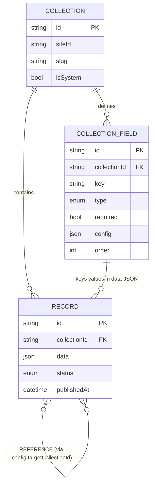
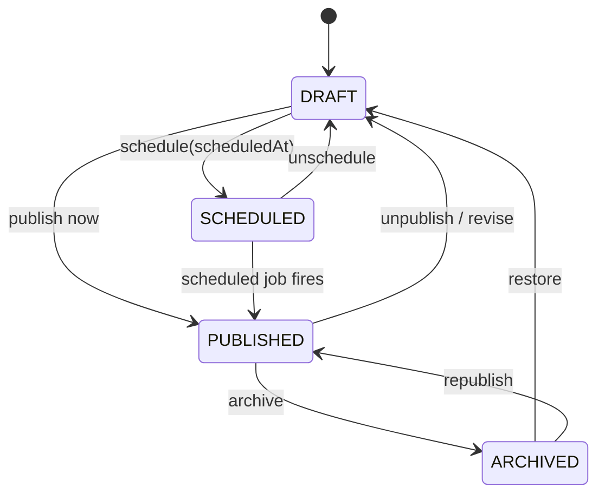

# easy-cms — Headless CMS Architecture

> Document 07 of the easy-cms documentation set. See [README](./README.md) for the full index.

This document describes the **headless content management system** at the heart of **easy-cms**. The CMS provides a structured, schema-driven content model that powers both built-in content types (pages, blog posts) and arbitrary user-defined content. It is implemented on Next.js 15 (App Router) + React 19 + TypeScript, persisted in PostgreSQL via Prisma, validated with Zod, edited with Tiptap, and delivered over a Content Delivery API with Incremental Static Regeneration (ISR).

For the data model and migrations see [Database Schema](./03-database-schema.md). For the runtime topology (control plane vs delivery plane) see [System Architecture](./02-architecture.md). For the public read API see [API Design](./04-api-design.md). For authorization of content mutations see [Auth Architecture](./08-auth-architecture.md).

---

## 1. Overview

easy-cms is **headless**: content is modeled, stored, and validated independently of how it is presented. A site author defines the *shape* of their content once and then creates many *instances* of it; the delivery layer fetches that content as structured data and renders it through themes, templates, and dynamic routes.

The model is built from three layered primitives:

| Primitive | Role | Analogy |
|---|---|---|
| `Collection` | A named content type bound to a site. | A database table / "content type". |
| `CollectionField` | A typed, ordered attribute belonging to a collection. | A column / schema field. |
| `Record` | A single content entry whose values live in a JSON blob keyed by field `key`. | A row. |

Records do **not** have a fixed relational column per attribute. Instead, each `Record.data` is a JSON object whose keys are the machine `key` of each `CollectionField`. This gives us a flexible, schema-on-write model: the *contract* lives in `CollectionField`, the *values* live in `Record.data`, and Zod (Section 5) bridges the two at write time.

### 1.1 System vs user-defined collections

Every collection carries an `isSystem` flag:

- **System collections** (`isSystem = true`) are provisioned automatically when a site is created — for example the built-in **Pages** and **Posts** types. Their fields and slugs are managed by the platform; the UI restricts destructive edits to protect built-in behavior.
- **User-defined collections** (`isSystem = false`) are created by site admins/editors — e.g. `products`, `team-members`, `case-studies`, `faqs`. They are fully editable.

Both kinds share the exact same storage and delivery machinery; `isSystem` is purely a governance/UX flag.

> **Note on the blog.** The blog is a *built-in content type* with a dedicated, first-class relational model (`Post`, `Category`, `Tag`) rather than a generic `Collection`. This is a deliberate trade-off: blogs need rich relational features (categories, tags, featured flags, authorship, SEO) that benefit from real columns and indexes. It nonetheless shares the same `ContentStatus` lifecycle (Section 7) and the same Tiptap content representation (Section 6) as generic records, so it behaves consistently in the editor and delivery layers.

---

## 2. The Content Model

```prisma
model Collection {
  id        String            @id @default(cuid())
  siteId    String
  name      String            // human label, e.g. "Case Studies"
  slug      String            // url/api segment, e.g. "case-studies"
  isSystem  Boolean           @default(false)
  fields    CollectionField[]
  records   Record[]

  @@unique([siteId, slug])
}

model CollectionField {
  id           String    @id @default(cuid())
  collectionId String
  name         String    // human label, e.g. "Hero Image"
  key          String    // machine key used in Record.data, e.g. "heroImage"
  type         FieldType
  required     Boolean   @default(false)
  config       Json?     // SELECT options, REFERENCE target, validation rules…
  order        Int

  @@unique([collectionId, key])
}

model Record {
  id           String        @id @default(cuid())
  collectionId String
  data         Json          // values keyed by CollectionField.key
  status       ContentStatus
  publishedAt  DateTime?

  @@index([collectionId, status])
}
```

Key design properties:

- **`@@unique([siteId, slug])`** guarantees a collection slug is unique *within a tenant*, never globally — two different sites may both own a `products` collection. This is the row-level multi-tenancy invariant described in [System Architecture](./02-architecture.md).
- **`@@unique([collectionId, key])`** guarantees each field key is unique within its collection, so `Record.data` keys never collide.
- **`@@index([collectionId, status])`** is the workhorse index for delivery queries such as "all published records of collection X".
- **`order Int`** drives field ordering in the editor and in generated forms.

---

## 3. Field Types

The `FieldType` enum enumerates every attribute kind a field can have. Each type defines (a) how it is rendered in the editor, (b) how its value is stored inside `Record.data`, and (c) what `config` it consumes.

```prisma
enum FieldType {
  TEXT
  TEXTAREA
  RICH_TEXT
  NUMBER
  BOOLEAN
  DATE
  IMAGE
  GALLERY
  JSON
  SELECT
  MULTI_SELECT
  REFERENCE
}
```

| FieldType | Description | Storage shape in `Record.data[key]` | `config` options | Example value |
|---|---|---|---|---|
| `TEXT` | Single-line string. | `string` | `{ maxLength?, pattern? }` | `"Acme Corp"` |
| `TEXTAREA` | Multi-line plain text. | `string` | `{ maxLength?, rows? }` | `"Long plain description…"` |
| `RICH_TEXT` | Formatted content edited with Tiptap. | Tiptap JSON document (`object`) | `{ extensions?, maxLength? }` | `{ "type": "doc", "content": [...] }` |
| `NUMBER` | Numeric value. | `number` | `{ min?, max?, integer? }` | `42` |
| `BOOLEAN` | True/false toggle. | `boolean` | `—` | `true` |
| `DATE` | Date or datetime. | ISO 8601 `string` | `{ mode?: "date" \| "datetime" }` | `"2026-06-16T00:00:00.000Z"` |
| `IMAGE` | Single media asset. | `{ id, url, alt? }` (media id + resolved URL) | `{ accept?, maxSizeMB? }` | `{ "id": "med_123", "url": "https://cdn…/x.jpg" }` |
| `GALLERY` | Ordered list of media assets. | `Array<{ id, url, alt? }>` | `{ maxItems? }` | `[{ "id": "med_1", "url": "…" }, …]` |
| `JSON` | Arbitrary structured data. | any JSON value | `{ schema? }` | `{ "lat": 51.5, "lng": -0.1 }` |
| `SELECT` | Single choice from a fixed set. | `string` (one option value) | `{ options: [{ value, label }] }` | `"published"` |
| `MULTI_SELECT` | Multiple choices from a fixed set. | `Array<string>` (option values) | `{ options: [{ value, label }] }` | `["news", "press"]` |
| `REFERENCE` | Link to record(s) in another collection. | `string` id, or `Array<string>` ids | `{ targetCollectionId, multiple? }` | `"rec_987"` or `["rec_1","rec_2"]` |

Media-backed fields (`IMAGE`, `GALLERY`) store both the media `id` (the durable handle into the S3/R2-backed media library) and a denormalized `url` for cheap reads; the URL is re-resolved if the asset is moved. See [API Design](./04-api-design.md) for upload/resolution endpoints.

---

## 4. References & Relationships

Relationships between content types are expressed with the `REFERENCE` field type. The relationship target is declared in `config`:

- `config.targetCollectionId` — the `Collection.id` that referenced records must belong to.
- `config.multiple` — when `true`, the field stores an **array** of record ids (a to-many relationship); when `false`/absent it stores a **single** id (a to-one relationship).

The value persisted in `Record.data[key]` is therefore *just an id (or array of ids)* — a loose foreign key into another collection's records. Referential integrity is enforced at the application layer (during Zod validation and resolution), not by a DB foreign-key constraint, because the reference is embedded inside a JSON column.

### 4.1 Resolving references on read

References are stored shallow and **resolved on read**. The delivery layer (or Content Delivery API) takes the stored id(s) and, optionally, hydrates them into the full target record(s) up to a configurable depth:

1. Read the source record.
2. For each `REFERENCE` field, collect the id(s) from `data[key]`.
3. Batch-fetch target records by id from `config.targetCollectionId` (scoped by `siteId`), using a single `findMany({ where: { id: { in: ids } } })` to avoid N+1.
4. Replace ids with hydrated records (or keep ids for shallow queries via an `?expand=` flag on the delivery API — see [API Design](./04-api-design.md)).

A depth limit prevents cyclic reference graphs from causing infinite expansion.

### 4.2 Entity diagram

The diagram below shows how a collection owns its fields and records, and how a `REFERENCE` field on one collection points at records in another collection.



Read this as: **Collection → Field → Record → Reference.** A field of type `REFERENCE` carries `config.targetCollectionId`, and the matching key inside a record's `data` JSON holds the id(s) of the target record(s) in that other collection.

---

## 5. Dynamic Validation with Zod

Because the schema is data (rows in `CollectionField`) rather than static TypeScript types, validation must be **built at runtime** from a collection's field definitions. Every write to `Record.data` is validated against a `z.object` derived from `CollectionField[]`.

```ts
import { z, ZodTypeAny } from "zod";
import type { CollectionField } from "@prisma/client";

/** Build a Zod object schema from a collection's field definitions. */
export function buildRecordSchema(fields: CollectionField[]) {
  const shape: Record<string, ZodTypeAny> = {};

  for (const field of fields) {
    let schema: ZodTypeAny;
    const cfg = (field.config ?? {}) as Record<string, any>;

    switch (field.type) {
      case "TEXT":
      case "TEXTAREA":
        schema = z.string();
        if (cfg.maxLength) schema = (schema as z.ZodString).max(cfg.maxLength);
        if (cfg.pattern) schema = (schema as z.ZodString).regex(new RegExp(cfg.pattern));
        break;

      case "RICH_TEXT":
      case "JSON":
        schema = z.record(z.any()); // Tiptap doc / arbitrary JSON object
        break;

      case "NUMBER": {
        let n = z.number();
        if (typeof cfg.min === "number") n = n.min(cfg.min);
        if (typeof cfg.max === "number") n = n.max(cfg.max);
        if (cfg.integer) n = n.int();
        schema = n;
        break;
      }

      case "BOOLEAN":
        schema = z.boolean();
        break;

      case "DATE":
        schema = z.string().datetime();
        break;

      case "IMAGE":
        schema = z.object({ id: z.string(), url: z.string().url(), alt: z.string().optional() });
        break;

      case "GALLERY":
        schema = z.array(
          z.object({ id: z.string(), url: z.string().url(), alt: z.string().optional() })
        );
        break;

      case "SELECT":
        // options come from config -> z.enum
        schema = z.enum((cfg.options ?? []).map((o: any) => o.value) as [string, ...string[]]);
        break;

      case "MULTI_SELECT":
        schema = z.array(
          z.enum((cfg.options ?? []).map((o: any) => o.value) as [string, ...string[]])
        );
        break;

      case "REFERENCE":
        // stores target Record id(s); cfg.multiple decides cardinality
        schema = cfg.multiple ? z.array(z.string().cuid()) : z.string().cuid();
        break;

      default:
        schema = z.any();
    }

    // required vs optional, keyed by the machine key
    shape[field.key] = field.required ? schema : schema.optional();
  }

  return z.object(shape).strict();
}
```

Usage on a write path (a server action or mutation handler) looks like:

```ts
const fields = await prisma.collectionField.findMany({ where: { collectionId } });
const schema = buildRecordSchema(fields);
const data = schema.parse(input.data); // throws ZodError on invalid content
await prisma.record.create({ data: { collectionId, data, status: "DRAFT" } });
```

This keeps three benefits: a single source of truth (`CollectionField`), strict rejection of unknown keys (`.strict()`), and field-type-aware error messages surfaced back to the editor. Reference fields are additionally checked for *existence* against the target collection during resolution (Section 4.1).

---

## 6. Content Editing with Tiptap

`RICH_TEXT` fields and the built-in `Post.content` are edited with **[Tiptap](https://tiptap.dev/)**, a headless ProseMirror-based editor that runs in the React 19 dashboard.

- **Storage format.** Content is stored as **Tiptap JSON** (a ProseMirror document: `{ "type": "doc", "content": [...] }`), *not* as HTML. JSON is structured, diffable, sanitizable, and forward-compatible with new node/mark types.
- **Editing.** The dashboard mounts a configured Tiptap editor (headings, lists, links, images from the media library, code blocks, etc.). Autosave debounces writes back through the validated write path.
- **Rendering.** On the published delivery side, the Tiptap JSON is rendered to HTML — server-side via `generateHTML()` with the same extension set, or through React renderers — so the published markup always matches the editing extensions. Sanitization is applied during render; see [Security](./09-security.md).

Because both generic `RICH_TEXT` records and built-in `Post.content` use the same JSON shape, a single rendering pipeline serves all rich content across the platform.

---

## 7. Publishing Workflow & Content Lifecycle

All content — generic `Record`s, built-in **Pages**, and blog **Posts** — shares the `ContentStatus` enum, giving the entire CMS one consistent editorial lifecycle.

```prisma
enum ContentStatus {
  DRAFT
  SCHEDULED
  PUBLISHED
  ARCHIVED
}
```

| Status | Meaning | Visible on public site? |
|---|---|---|
| `DRAFT` | Work in progress; editable. | No |
| `SCHEDULED` | Approved and queued to go live at `scheduledAt` / `publishedAt`. | No (until the scheduled time) |
| `PUBLISHED` | Live and delivered. | Yes |
| `ARCHIVED` | Retired from the public site but retained. | No |

### 7.1 State machine



Transitions are guarded by RBAC permissions (`content:publish`, `page:publish`, `site:publish`) — see [Auth Architecture](./08-auth-architecture.md).

### 7.2 Scheduled publishing

Scheduled content uses the `scheduledAt` timestamp (and `Record.publishedAt` / `Post.publishedAt`). A **background job** — a Redis-backed worker that polls (or consumes a delayed queue) on a short interval — promotes due `SCHEDULED` content to `PUBLISHED`:

```ts
// runs periodically (cron / queue consumer)
const due = await prisma.record.findMany({
  where: { status: "SCHEDULED", publishedAt: { lte: new Date() } },
});
for (const rec of due) {
  await prisma.record.update({ where: { id: rec.id }, data: { status: "PUBLISHED" } });
  await revalidateForRecord(rec); // trigger ISR revalidation
}
```

The same worker handles scheduled `Post`s (using `scheduledAt`). After promotion it triggers ISR revalidation so the new content appears on the next request.

---

## 8. Content Delivery

Published content reaches visitors two ways, both scoped to a single tenant:

1. **Content Delivery API** — a read-only HTTP API that returns published records/posts as JSON (with optional reference expansion). This powers external/headless consumers and decoupled frontends. See [API Design](./04-api-design.md) for endpoints, filtering, pagination, and the `?expand=` reference-hydration flag.
2. **Dynamic listing & detail pages** — Next.js App Router dynamic routes bound to a collection (e.g. `/[collectionSlug]` for listings and `/[collectionSlug]/[recordSlug]` for detail), and built-in blog routes. These pages query the CMS, render Tiptap content to HTML, and are served with **Incremental Static Regeneration (ISR)**: pages are statically generated and revalidated on a tag/time basis. Publishing or scheduling content triggers targeted revalidation (Section 7.2) so updates propagate without a full rebuild.

This corresponds to the **delivery plane** in [System Architecture](./02-architecture.md): fast, cacheable, CDN-fronted reads, distinct from the authenticated control plane where editing happens.

---

## 9. Tenant Scoping

Multi-tenancy in easy-cms is **shared-database, row-level isolation**. Every CMS query is scoped by `siteId`:

- `Collection` is owned by a site (`@@unique([siteId, slug])`).
- `Record` belongs to a `Collection`, which belongs to a site; record queries always join through (or pre-resolve) `collectionId` for a known site.
- `Post`, `Category`, `Tag` carry `siteId` directly.
- Reference resolution (Section 4.1) filters target records by the same `siteId`, so references can never cross a tenant boundary.

These scoping rules are centralized in the data-access layer and enforced alongside RBAC permission checks. See [Auth Architecture](./08-auth-architecture.md) for the permission model and [Security](./09-security.md) for defense-in-depth around tenant isolation.

---

## 10. Summary

- Content is modeled with `Collection` → `CollectionField` → `Record`, with values stored in a JSON blob keyed by field `key`.
- `isSystem` distinguishes built-in (pages/posts) from user-defined collections; the blog is a first-class built-in type sharing the same lifecycle and content format.
- Twelve `FieldType`s cover text, rich text, numbers, media, structured JSON, enumerated choices, and references.
- Relationships are loose foreign keys stored as ids and resolved on read.
- Validation is a Zod schema built dynamically from `CollectionField[]`, enforced on every write.
- Tiptap powers rich content, stored as JSON and rendered to HTML on delivery.
- A single `ContentStatus` lifecycle (with scheduled publishing via a background job) governs all content.
- Delivery is via the Content Delivery API and ISR-backed dynamic routes, always scoped by `siteId`.
