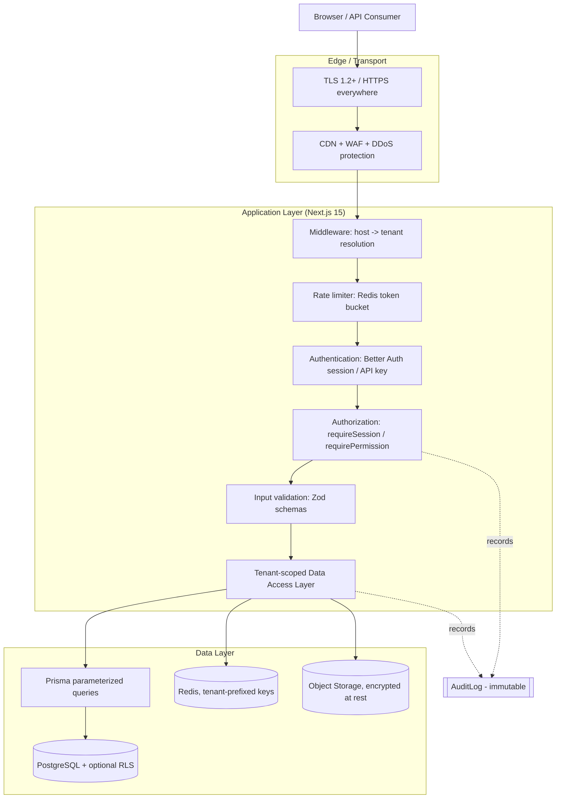

# easy-cms — Security

> Document 09 of the easy-cms documentation set. See [README](./README.md) for the full index.

This document describes the security model for **easy-cms**, a multi-tenant SaaS website builder & headless CMS. It covers the defense-in-depth strategy, role-based access control, tenant isolation, CSRF and rate-limiting protections, input validation, audit logging, encryption and secrets management, and a full mapping against the OWASP Top 10 (2021).

Related reading: [System Architecture](./02-architecture.md) · [Database Schema](./03-database-schema.md) · [API Design](./04-api-design.md) · [Auth Architecture](./08-auth-architecture.md) · [Billing](./13-billing.md).

---

## 1. Security Model Overview

easy-cms is a **shared-database, row-level-isolated** multi-tenant platform. A single compromised request must never be able to read or mutate another tenant's data, and a single compromised dependency must be contained by layered controls. We therefore treat security as a stack of independent, overlapping layers — no single control is trusted to be sufficient on its own.

The guiding principles are:

- **Defense in depth** — every request passes through multiple, independent checks (transport, authentication, authorization, tenant scoping, validation).
- **Secure by default** — the data-access layer refuses to run an unscoped tenant query; guards deny by default and only allow on an explicit permission grant.
- **Least privilege** — RBAC roles grant the minimum capability; API keys are scoped and hashed; service credentials are environment-injected, never embedded.
- **Auditability** — all sensitive state-changing actions are recorded in an immutable `AuditLog`.

### 1.1 Defense-in-Depth Diagram



A request that survives every layer is, by construction, authenticated, authorized, rate-limited, validated, and scoped to exactly one tenant.

---

## 2. Role-Based Access Control (RBAC)

Authorization is enforced through RBAC. The full role/permission matrix, role hierarchy, and inheritance rules live in [08 — Auth Architecture](./08-auth-architecture.md); this section summarizes the enforcement mechanics relevant to security.

### 2.1 Roles

| Scope | Roles |
|---|---|
| Organization (tenant) | `ADMIN`, `EDITOR`, `AUTHOR`, `MEMBER` |
| Platform | `SUPER_ADMIN`, `USER` |

`ADMIN` administers an organization and its sites; `EDITOR` manages content and publishing; `AUTHOR` creates and edits its own content; `MEMBER` has read/limited access. At the platform level, `SUPER_ADMIN` is reserved for easy-cms operators and `USER` is the default for everyone else.

### 2.2 Enforcement

Permission logic is centralized in `packages/core/src/rbac.ts`:

- **`can(role, permission)`** — returns whether a role holds a specific permission.
- **`atLeast(role, minimumRole)`** — hierarchical comparison (e.g. is this role at least an `EDITOR`).

Route handlers and server actions never call these primitives ad hoc. Instead they use the guards in `apps/web/src/lib/guards.ts`:

```ts
// apps/web/src/lib/guards.ts (shape)
export async function requireSession() {
  const session = await getSession();
  if (!session) throw new Unauthorized();
  return session;
}

export async function requirePermission(permission: Permission, ctx: TenantContext) {
  const session = await requireSession();
  // Platform operators bypass tenant RBAC.
  if (session.user.platformRole === "SUPER_ADMIN") return session;
  const role = ctx.membership?.role;
  if (!role || !can(role, permission)) throw new Forbidden();
  return session;
}
```

Key properties:

- **Deny by default** — absence of an explicit grant yields `Forbidden`.
- **`SUPER_ADMIN` bypass** — platform operators are exempt from per-tenant checks (and every such access is audit-logged).
- **Centralized** — guards are the single chokepoint, so authorization cannot be silently forgotten in a new handler.

---

## 3. Tenant Isolation Enforcement

Tenant isolation is the single most important security property of a shared-database multi-tenant system. Every tenant-owned row carries `organizationId` and/or `siteId`, and isolation is enforced at multiple layers.

### 3.1 Tenant resolution (middleware)

Next.js middleware resolves the tenant from the request **host** (`{slug}.{ROOT_DOMAIN}` or a verified custom domain) before any handler runs, and attaches the resolved `organizationId` / `siteId` to the request context. See the host→tenant rewrite in [02 — Architecture](./02-architecture.md) and the deployment view in [10 — Deployment](./10-deployment.md).

### 3.2 Data-Access Layer (DAL)

All reads and writes go through a tenant-scoped data-access layer in `apps/web/src/lib/data`. The DAL **injects** the `WHERE organizationId = … / siteId = …` clause from the resolved tenant context; callers cannot bypass it because they never receive a raw Prisma client for tenant tables.

```ts
// apps/web/src/lib/data/pages.ts (shape)
export async function listPages(ctx: TenantContext) {
  return prisma.page.findMany({
    where: { siteId: ctx.siteId }, // injected, never caller-supplied
    orderBy: { updatedAt: "desc" },
  });
}
```

Writes additionally re-assert the scope on the row being mutated, so a guessed `id` from another tenant cannot be updated.

### 3.3 Optional PostgreSQL Row-Level Security (RLS)

As a defense-in-depth second layer, the architecture proposes optional **PostgreSQL RLS** policies keyed on a session variable (e.g. `app.current_org`). With RLS enabled, even a bug in the DAL — or direct SQL from a future service — cannot leak cross-tenant rows, because the database itself filters them. See [03 — Database Schema](./03-database-schema.md) for the policy design.

### 3.4 Tenant-prefixed cache keys

Every Redis cache key is **tenant-prefixed** (e.g. `org:{organizationId}:site:{siteId}:page:{slug}`). This prevents cache-key collisions from serving one tenant's content to another and makes per-tenant invalidation precise.

### 3.5 Things that could leak — and how we prevent them

| Leak vector | Prevention |
|---|---|
| Forgotten `WHERE organizationId` in a query | All tenant data flows through the DAL, which injects scoping; raw Prisma access to tenant tables is not exposed. |
| IDOR — guessing another tenant's `id` | Writes/reads re-assert tenant scope on the target row; mismatched scope returns not-found, not the row. |
| Cache key collision | Tenant-prefixed cache keys. |
| Cross-tenant via misresolved host | Middleware verifies host against known sites/verified custom domains; unknown hosts are rejected. |
| Background jobs running unscoped | Workers carry the tenant context in the job payload and use the same DAL. |
| SQL injection bypassing scoping | Prisma parameterized queries; no string-built SQL on tenant tables. |
| Direct DB access by a future service | Optional RLS enforces isolation at the database tier regardless of application code. |
| Object storage cross-access | Media keys are prefixed by `organizationId`/`siteId`; signed URLs are scoped and time-limited. |

---

## 4. CSRF Protection

State-changing requests are protected against Cross-Site Request Forgery through layered controls:

- **Better Auth cookie protections** — session cookies use `SameSite` and the framework's built-in CSRF token handling for auth flows.
- **`SameSite` cookies** — session cookies are `SameSite=Lax`/`Strict` and `HttpOnly`/`Secure`, so they are not sent on cross-site form posts.
- **Server Actions** — Next.js Server Actions carry built-in CSRF/origin protections; we rely on these rather than hand-rolled tokens for dashboard mutations.
- **Public API is cookie-free** — state-changing public API endpoints require a **Bearer API key**, *not* cookies. Because the API does not trust ambient cookies, classic CSRF (which depends on the browser auto-attaching credentials) does not apply to it.

---

## 5. Rate Limiting

A Redis-backed **token bucket** limiter throttles abusive traffic, keyed per **API key** (authenticated) or per **IP** (unauthenticated/public). Each request consumes a token; buckets refill at a fixed rate. When a bucket is empty the request is rejected with **HTTP 429 Too Many Requests** plus `Retry-After` and `X-RateLimit-*` headers. Limits and bucket sizes per plan/endpoint are documented in [04 — API Design](./04-api-design.md). Because the counters live in Redis, limits hold consistently across all stateless app instances.

---

## 6. Input Validation (Zod)

All untrusted input is parsed with **Zod** before it reaches business logic or the database. Validation is not a courtesy — it is a security boundary that prevents malformed or hostile payloads from corrupting the block tree, the content model, or the database.

### 6.1 Page block tree

`savePage` validates the entire block tree with `pageContentSchema` before persisting. The recursive schema rejects unknown block types, malformed props, and excessive nesting.

```ts
const blockSchema: z.ZodType<Block> = z.lazy(() =>
  z.object({
    id: z.string().uuid(),
    type: z.enum(["section", "text", "image", "columns", "embed"]),
    props: z.record(z.unknown()),
    children: z.array(blockSchema).max(500).optional(),
  })
);

export const pageContentSchema = z.object({
  version: z.literal(1),
  root: z.array(blockSchema),
});
```

### 6.2 CMS record data

A headless content type defines a **field schema**; `Record.data` is validated by a Zod schema **built dynamically from that field schema** at save time. A `number` field rejects strings, a `required` field rejects null, a `relation` field validates the referenced id — all before write.

```ts
const recordSchema = buildZodSchemaFromFields(contentType.fields);
const data = recordSchema.parse(input.data); // throws on invalid input
```

### 6.3 API payloads

Every public/internal API input is **Zod-parsed** at the handler boundary; a parse failure returns a `400` with a structured error (see [04 — API Design](./04-api-design.md)).

```ts
const Body = z.object({
  title: z.string().min(1).max(200),
  slug: z.string().regex(/^[a-z0-9-]+$/),
  status: z.enum(["draft", "published"]),
});
const body = Body.parse(await req.json());
```

---

## 7. Audit Logging

Sensitive, state-changing actions are recorded in an append-only `AuditLog`, providing a forensic trail and supporting compliance and incident response.

### 7.1 AuditLog schema

| Field | Type | Description |
|---|---|---|
| `id` | string | Primary key |
| `organizationId` | string | Tenant scope of the action |
| `userId` | string \| null | Actor (null for system/automated actions) |
| `action` | string | Dotted action name (e.g. `site.published`) |
| `entityType` | string | Affected entity type (e.g. `Site`, `User`, `ApiKey`) |
| `entityId` | string | Affected entity id |
| `metadata` | json | Action-specific context (before/after, plan, etc.) |
| `ipAddress` | string | Source IP of the request |
| `createdAt` | datetime | Timestamp |

### 7.2 Sample actions

- `site.published`, `site.unpublished`
- `user.invited`, `user.removed`, `user.role_changed`
- `apikey.created`, `apikey.revoked`
- `domain.verified`, `domain.ssl_issued`
- `billing.plan_changed`, `billing.subscription_canceled`
- `record.deleted`, `page.deleted`

### 7.3 What gets logged and retention

We log **who** did **what** to **which entity**, **when**, and **from where** — never plaintext secrets or full content bodies (only references/diffs in `metadata`). Logs are **immutable** (no in-place updates or deletes from application code). Default retention is **365 days** of hot storage with optional cold archival for compliance; retention is configurable per plan. `SUPER_ADMIN` bypass accesses are always logged.

---

## 8. Encryption, Secrets, and Credential Hashing

### 8.1 In transit

- **HTTPS everywhere** — TLS 1.2+ terminates at the edge/CDN; HTTP is redirected to HTTPS.
- **Custom-domain SSL** — per-customer custom domains receive certificates issued via **ACME / Let's Encrypt** (see [10 — Deployment](./10-deployment.md)).

### 8.2 At rest

- **Database** — PostgreSQL storage encryption at rest.
- **Object storage** — S3 / Cloudflare R2 server-side encryption for media.

### 8.3 Secrets management

Secrets are supplied exclusively through **environment variables** (documented as placeholders in `.env.example`) and are **never committed**:

| Secret | Purpose |
|---|---|
| `BETTER_AUTH_SECRET` | Session signing (32+ characters required) |
| `DATABASE_URL` | PostgreSQL connection string |
| `S3_ACCESS_KEY_ID` / `S3_SECRET_ACCESS_KEY` | Object storage credentials |
| `STRIPE_SECRET_KEY` | Stripe API access |
| `STRIPE_WEBHOOK_SECRET` | Stripe webhook signature verification |
| `ANTHROPIC_API_KEY` | Claude API access |

The full environment variable inventory lives in [10 — Deployment](./10-deployment.md).

### 8.4 Credential & key hashing

- **`ApiKey`** — stored as a one-way `hashedKey` plus a short non-secret `prefix` used for lookup/display. The raw key is shown **once** at creation and never persisted.
- **`Account.password`** — hashed by Better Auth (scrypt/bcrypt); plaintext passwords are never stored.
- **`Webhook.secret`** — used to compute an **HMAC** signature on outbound webhook payloads so consumers can verify authenticity and integrity.

---

## 9. OWASP Top 10 (2021) Mapping

| Risk | How it applies to easy-cms | Mitigation |
|---|---|---|
| **A01 Broken Access Control** | Cross-tenant data access, IDOR, privilege escalation between roles. | Centralized RBAC (`can`/`atLeast` + `requireSession`/`requirePermission`, deny-by-default); tenant-scoped DAL injecting `organizationId`/`siteId`; optional PostgreSQL RLS; audit logging of `SUPER_ADMIN` bypass. |
| **A02 Cryptographic Failures** | Exposure of passwords, API keys, sessions, or media. | TLS everywhere; DB + object-storage encryption at rest; passwords hashed (Better Auth scrypt/bcrypt); API keys stored as `hashedKey`+`prefix`; `BETTER_AUTH_SECRET` 32+ chars. |
| **A03 Injection** | SQL injection, NoSQL/command injection, XSS via stored block content. | Prisma **parameterized queries** (no string-built SQL); Zod validation of all inputs including the block tree and record data; output encoding/sanitization of rendered content. |
| **A04 Insecure Design** | Multi-tenant boundary bugs, missing rate limits, trust of client-supplied tenant ids. | Secure-by-default DAL (no unscoped tenant queries); tenant resolved server-side from host, never client; threat-modeled isolation layers; rate limiting designed in. |
| **A05 Security Misconfiguration** | Leaked secrets, permissive CORS, debug endpoints in prod. | Secrets via env vars (`.env.example` placeholders, never committed); `NODE_ENV=production` hardening; scoped object-storage CORS; security headers at the edge. |
| **A06 Vulnerable & Outdated Components** | Vulnerabilities in npm dependencies. | `pnpm install --frozen-lockfile`; dependency scanning (`pnpm audit` / Dependabot) in CI; pinned base images (`node:22-alpine`, `postgres:16`, `redis:7`). |
| **A07 Identification & Authentication Failures** | Session hijacking, weak credentials, brute force. | Better Auth sessions with `HttpOnly`/`Secure`/`SameSite` cookies; password hashing; rate limiting on auth endpoints; OAuth providers (Google/GitHub/Facebook). |
| **A08 Software & Data Integrity Failures** | Forged or tampered webhooks (Stripe, outbound), unsigned artifacts. | Stripe webhook signature verification (`STRIPE_WEBHOOK_SECRET`); outbound `Webhook.secret` **HMAC** signing; frozen lockfile for reproducible builds. |
| **A09 Security Logging & Monitoring Failures** | Undetected breaches, no forensic trail. | Immutable `AuditLog` of sensitive actions with actor/IP/timestamp; rate-limit and error monitoring; alerting on anomalous activity. |
| **A10 Server-Side Request Forgery (SSRF)** | Webhook URLs, custom-domain checks, or AI/media fetches pointed at internal services/metadata endpoints. | Webhook/destination **URL allowlist**; block private/link-local/metadata IP ranges; validate and resolve hostnames before fetch; egress restrictions. |

---

## 10. Security Checklist

- [ ] All tenant tables carry `organizationId`/`siteId` and are accessed only via the DAL.
- [ ] No raw Prisma access to tenant tables outside the DAL.
- [ ] (Optional) PostgreSQL RLS policies enabled in production.
- [ ] Redis cache keys are tenant-prefixed.
- [ ] Every route handler / server action calls `requireSession` / `requirePermission`.
- [ ] `SUPER_ADMIN` bypass paths are audit-logged.
- [ ] All API inputs, the block tree, and record data are Zod-validated.
- [ ] Session cookies are `HttpOnly` + `Secure` + `SameSite`.
- [ ] Public state-changing API requires a Bearer API key, not cookies.
- [ ] Rate limiting active per API key / IP; returns 429 with `Retry-After`.
- [ ] `BETTER_AUTH_SECRET` is 32+ chars and unique per environment.
- [ ] No secrets committed; all loaded from env (`.env.example` is placeholder-only).
- [ ] API keys, passwords stored hashed; raw API key shown once.
- [ ] Stripe webhooks verify `STRIPE_WEBHOOK_SECRET`; outbound webhooks HMAC-signed.
- [ ] TLS enforced; custom-domain certs auto-issued via ACME.
- [ ] DB and object storage encryption at rest enabled.
- [ ] Webhook/egress URL allowlist blocks private & metadata IP ranges (SSRF).
- [ ] Dependency scanning runs in CI; lockfile frozen.
- [ ] AuditLog retention configured and immutable.

---

_See also: [02 — Architecture](./02-architecture.md) · [03 — Database Schema](./03-database-schema.md) · [04 — API Design](./04-api-design.md) · [08 — Auth Architecture](./08-auth-architecture.md) · [10 — Deployment](./10-deployment.md) · [13 — Billing](./13-billing.md)._
