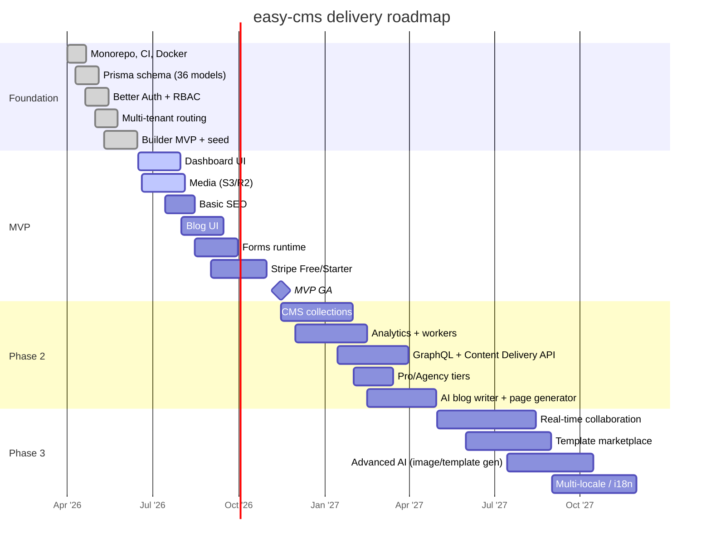

# easy-cms — Product Roadmap

> Document 11 of the easy-cms documentation set. See [README](./README.md) for the full index.

| Field | Value |
|---|---|
| Document | Product Roadmap |
| Status | Living document |
| Owner | Product / Architecture |
| Last updated | 2026-06-16 |

---

## 1. Roadmap philosophy

easy-cms is built in **thin, shippable slices**. Rather than building every subsystem to completion in isolation, we deliver vertically: each phase produces something a real tenant can use end-to-end, on top of a foundation that was deliberately over-invested so later phases bolt on rather than rewrite.

Three principles govern sequencing:

1. **Foundation first, breadth later.** The multi-tenant data model, auth, RBAC, tenant routing and the builder's core data structures were built ahead of the UI that exercises them. The full 36-model Prisma schema and the recursive `BlockNode` tree already exist, so feature phases add screens and runtimes — not migrations and architecture.
2. **Bound the MVP ruthlessly.** Per [PRD §9](./01-PRD.md), the MVP is a fixed list. Anything not on that list (CMS collections, analytics, GraphQL, AI, real-time co-editing) is explicitly deferred. Scope creep into the MVP is treated as a defect.
3. **Tie every phase to KPIs.** Each phase declares success criteria mapped to the [PRD §8 KPIs](./01-PRD.md#8-success-metrics--kpis) so "done" is measurable, not vibes.

### Current status, in one sentence

> **The foundation is built; we are building toward MVP.** The scaffold, schema, auth/RBAC, multi-tenant routing and a working builder MVP are complete; the product-facing surfaces (dashboard, media, forms runtime, blog, billing wiring) are the work in flight.

---

## 2. What's built today

The table below reflects the literal state of the repository as of 2026-06-16.

| Area | Feature | Status |
|---|---|---|
| Platform | Monorepo scaffold (`apps/web`, `packages/db`, `packages/core`), CI, Docker | ✅ Done |
| Data | Full Prisma schema — all 36 models + enums | ✅ Done |
| Data | Seed: plans (Free/Starter/Professional/Agency), default global theme, templates, demo org/site/page | ✅ Done |
| Auth | Better Auth: email/password + verification, Google / GitHub / Facebook OAuth | ✅ Done |
| Auth | Route guards, RBAC helpers (`can` / `atLeast`, role × permission matrix) | ✅ Done |
| Tenancy | Host → tenant routing (middleware + `resolveTenant` + `_sites` ISR route) | ✅ Done |
| Builder | `BlockNode` tree, component registry (9 sections + 3 components) | ✅ Done (MVP) |
| Builder | dnd-kit canvas + palette, Zustand store with undo/redo + autosave | ✅ Done (MVP) |
| Builder | `savePage` server action writing `PageVersion` snapshots | ✅ Done (MVP) |
| Builder | `BlockRenderer` shared by editor + published site | ✅ Done (MVP) |
| Dashboard | Full dashboard UI (org/site/page management screens) | 🟡 In progress |
| Media | Uploads to S3 / R2, media library | 🟡 In progress |
| Forms | Forms runtime + submission capture | ⬜ Planned (MVP) |
| Blog | Blog authoring + published blog UI | ⬜ Planned (MVP) |
| SEO | Basic SEO (meta, sitemap, OG) | ⬜ Planned (MVP) |
| Billing | Stripe checkout / portal wiring (Free / Starter) | ⬜ Planned (MVP) |
| CMS | Headless collections UI + content modeling | ⬜ Planned (Phase 2) |
| Analytics | Page-view / engagement analytics | ⬜ Planned (Phase 2) |
| API | GraphQL + public Content Delivery API | ⬜ Planned (Phase 2) |
| AI | AI blog writer + page generator | ⬜ Planned (Phase 2) |
| Collaboration | Real-time multiplayer co-editing | ⬜ Planned (Phase 3) |
| Marketplace | Template marketplace | ⬜ Planned (Phase 3) |
| AI | Advanced AI (image gen, full-template generation) | ⬜ Planned (Phase 3) |
| i18n | Multi-locale content | ⬜ Planned (Phase 3) |
| Ops | Background workers, custom-domain SSL automation | ⬜ Planned (cross-cutting) |

Legend: ✅ Done · 🟡 In progress · ⬜ Planned.

---

## 3. Phase 0 — Foundation (✅ Done)

The foundation phase established the platform's load-bearing architecture before any feature UI. It is complete.

**Delivered:**

- **Monorepo & toolchain.** Workspaces for `apps/web` (Next.js 15 App Router + React 19 + TS), `packages/db` (Prisma client + schema + seed), `packages/core` (framework-agnostic domain logic incl. the builder schema). CI pipeline and Docker images for local + build parity.
- **Database.** Complete Prisma schema: 36 models with their enums covering users, organizations & members, sites, pages & page versions, themes, templates, media, forms & submissions, CMS collections & entries, plans & subscriptions, and audit/activity. See [03-database-schema.md](./03-database-schema.md).
- **Authentication & authorization.** Better Auth with email/password (+ email verification) and Google / GitHub / Facebook OAuth providers. Server-side route guards and an RBAC layer (`can(permission)`, `atLeast(role)`) backed by a role × permission matrix. See [08-auth-architecture.md](./08-auth-architecture.md).
- **Multi-tenancy.** Host-header → tenant resolution in middleware, a `resolveTenant` helper, and a published-site ISR route group (`_sites`) that serves cached static HTML per tenant. See [02-architecture.md](./02-architecture.md).
- **Builder MVP.** Recursive `BlockNode` tree, a component registry (9 sections + 3 component primitives), a dnd-kit drag-and-drop canvas and palette, a Zustand editor store with undo/redo and autosave, a `savePage` server action that persists `PageVersion` snapshots, and a `BlockRenderer` shared by both the editor and the published site. See [06-builder-architecture.md](./06-builder-architecture.md) and [12-component-library.md](./12-component-library.md).
- **Seed data.** Billing plans, a default global theme, starter marketplace templates, and a demo organization / site / page for local development.

**Exit state:** a developer can clone, `docker compose up`, seed, sign in, resolve a tenant, drag blocks onto a page, autosave a version, and view the published render. Everything below builds on this.

---

## 4. MVP (🟡 In progress)

The MVP is the smallest product that a paying solo user or small team can run a real marketing site on. Scope is fixed per [PRD §9](./01-PRD.md).

### 4.1 In scope

| Capability | Notes |
|---|---|
| Auth | ✅ Already complete from Foundation. |
| Organizations & RBAC | ✅ Already complete from Foundation. |
| Sites | Create / configure sites; status lifecycle (draft → published). |
| Visual builder | ✅ Core complete; harden inspector, palette, autosave UX. |
| Pages | CRUD, version history via `PageVersion`, publish. |
| Themes | Apply default theme + per-site override (`Site.themeId`). |
| Media | Uploads to S3 / R2, media picker in the image inspector field. |
| Basic SEO | Per-page title/description/OG, generated sitemap & robots. |
| Blog | Post authoring on the builder + a published blog listing/detail UI. |
| Forms | Form blocks, runtime submission handling, submissions inbox. |
| Billing | Stripe checkout + customer portal for **Free** and **Starter** only. |

### 4.2 Explicitly out of scope (deferred)

- Headless CMS collections UI, analytics, GraphQL / public Content Delivery API → **Phase 2**.
- Professional / Agency billing tiers and any AI feature → **Phase 2**.
- Real-time co-editing, template marketplace, advanced AI, multi-locale → **Phase 3**.

> The builder ships **single-editor with autosave** in the MVP (PRD non-goal **N6**): one editor at a time, no live presence or merge. Multiplayer is Phase 3.

### 4.3 Success criteria (→ PRD KPIs)

- Sign-up → first published site **≥ 35% within 7 days**; median time-to-first-publish **≤ 30 min**.
- Editor autosave success **≥ 99.9%**; publish pipeline success **≥ 99.9%**.
- Published-site Lighthouse Performance (p75) **≥ 90**; LCP (p75) **≤ 2.0s**.
- **Zero** cross-tenant data-leak incidents.

### 4.4 Risks & dependencies

- **Media pipeline** depends on object-storage credentials (S3/R2) and signed-URL handling; blocks the image inspector field and blog cover images.
- **Stripe wiring** depends on webhook delivery + Redis-backed idempotency for subscription state.
- **Publish performance** depends on the `_sites` ISR route hitting the Lighthouse target under realistic page weight.

---

## 5. Phase 2 — Structured content, insight & monetization

Turn easy-cms from a site builder into a **headless CMS platform** and unlock the higher tiers.

**Scope:**

- **Headless CMS collections.** UI for defining content models (fields, relations) on top of the existing collection/entry models, and an editing experience for entries that can be bound into builder blocks.
- **Analytics.** Per-site page-view and engagement analytics with a dashboard, aggregated through background workers and Redis.
- **GraphQL + public Content Delivery API.** A read API over published content and collections, with API keys scoped per site/org, for headless front-end consumers. See [04-api-design.md](./04-api-design.md).
- **Professional / Agency tiers.** Extend Stripe wiring to all four plans, gating AI, white-label and higher quotas per the seeded plan features.
- **AI blog writer + page generator.** Claude API integration: draft blog posts and generate page block trees from a prompt, gated to AI-enabled plans (Professional/Agency).

**Success criteria (→ PRD KPIs):**

- AI feature adoption among paid accounts **≥ 25%**; AI-assisted drafts kept (≥ 50% of text) **≥ 40%**.
- Free → paid conversion **≥ 6%**; net revenue retention **≥ 105%**.
- Reusable blocks per agency **≥ 25** (collections + reuse begin to compound).

**Risks & dependencies:**

- **Background workers** must exist before analytics aggregation and AI jobs — a cross-cutting prerequisite (§7).
- **AI cost control**: per-account credit budgeting required so AI cost/account stays within the budgeted allotment.
- **API multi-tenancy**: the Content Delivery API must enforce the same tenant isolation guarantees as the control plane (see [09-security.md](./09-security.md)).

---

## 6. Phase 3 — Collaboration, marketplace & global reach

Move from "powerful for one editor" to "powerful for a team and a marketplace."

**Scope:**

- **Real-time collaboration.** Replace single-editor + autosave with live multiplayer co-editing (presence, cursors, conflict-free merge of the `BlockNode` tree).
- **Template marketplace.** Publish, discover, install and (optionally) monetize templates beyond the seeded starter set.
- **Advanced AI.** Image generation and full-template generation from a brief, extending the Phase 2 AI writer.
- **Multi-locale / i18n.** Per-locale content variants for pages and collection entries, with locale-aware published routing.

**Success criteria (→ PRD KPIs):**

- Weekly active editors / paid accounts **≥ 60%**; sites per Agency account (avg) **≥ 12**.
- Published-site (CDN) uptime **≥ 99.95%**; control-plane uptime **≥ 99.9%** sustained at scale.

**Risks & dependencies:**

- **CRDT/OT complexity** for the recursive block tree is the single largest technical risk; depends on a real-time transport layer (e.g. WebSocket service + Redis pub/sub).
- **Marketplace trust & safety** (template review, payouts) introduces compliance surface.
- **i18n data model** may require additive schema migrations; design to extend, not rewrite, existing page/entry models.

---

## 7. Cross-cutting / platform work

Some work is not a phase but a prerequisite that several phases depend on:

- **Background workers** — required for analytics aggregation (P2), AI jobs (P2/P3), email and publish post-processing. Land early in Phase 2.
- **Custom-domain SSL automation** — automated certificate issuance/renewal for tenant custom domains; needed once Starter+ customers attach domains (MVP/early P2).
- **Observability & cost guardrails** — metrics, tracing and AI/credit budgeting underpinning every KPI target.

---

## 8. Milestones & target quarters

Targets are **relative**, anchored to a mid-2026 start. They will move; treat them as planning intent, not commitments.

| Milestone | Phase | Target |
|---|---|---|
| M0 — Foundation complete | Phase 0 | ✅ Q2 2026 (done) |
| M1 — MVP feature-complete (sites, builder hardening, media, SEO) | MVP | Q3 2026 |
| M2 — MVP GA (blog, forms, Stripe Free/Starter) | MVP | Q4 2026 |
| M3 — CMS collections + analytics | Phase 2 | Q1 2027 |
| M4 — GraphQL/CDA + Professional/Agency tiers + AI writer | Phase 2 | Q2 2027 |
| M5 — Real-time collaboration + template marketplace | Phase 3 | Q3 2027 |
| M6 — Advanced AI + multi-locale | Phase 3 | Q4 2027 |

### 8.1 Timeline (Gantt)

---

## 9. How to read & maintain this roadmap

- **Status truth lives in the table in §2.** Update it as features land; it should always match the repository.
- **Scope changes go through the PRD.** If the MVP list changes, change [01-PRD.md §9](./01-PRD.md) first, then this document.
- **Dates are relative.** Quarters express ordering and rough effort, not deadlines.

See also: [01-PRD.md](./01-PRD.md) · [02-architecture.md](./02-architecture.md) · [06-builder-architecture.md](./06-builder-architecture.md) · [12-component-library.md](./12-component-library.md).
