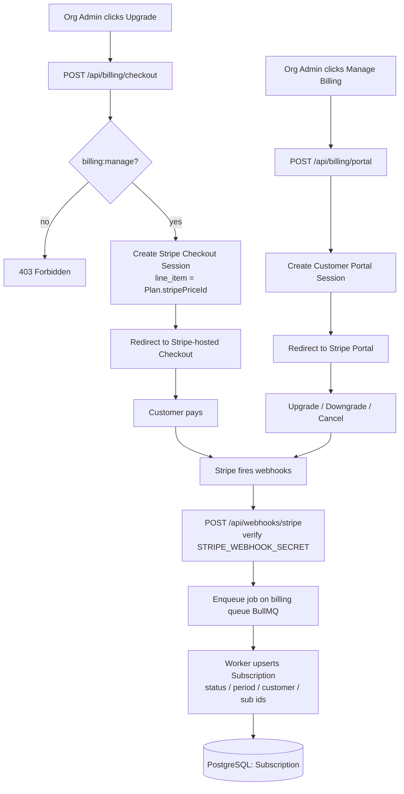
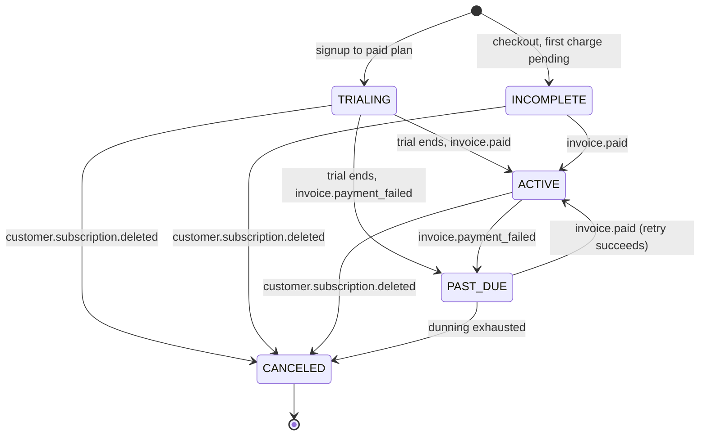

# easy-cms — Billing & Subscriptions

> Document 13 of the easy-cms documentation set. See [README](./README.md) for the full index.

## 1. Overview

Billing in easy-cms is anchored to the **Organization** — the tenant root. Every
Organization is a Stripe customer and carries exactly **one** `Subscription`. There
is no per-user or per-site billing: seats, sites, pages, and storage are all
metered against the Organization's active plan.

The billing surface is built on three pillars:

- **Stripe Checkout** — the hosted flow that converts a free/trialing Organization
  into a paying one. We never touch raw card data; Stripe handles PCI scope.
- **Stripe Customer Portal** — the hosted self-service surface where admins
  upgrade, downgrade, change payment methods, and cancel.
- **Webhooks** — the source of truth for subscription state. Stripe emits events;
  we reconcile our `Subscription` row against them asynchronously via the billing
  queue (BullMQ — see [./02-architecture.md](./02-architecture.md)).

The local `Plan` and `Subscription` tables are a **cache and policy layer** over
Stripe. Stripe owns money movement and lifecycle truth; easy-cms owns
entitlements (what a plan unlocks) and enforcement (limits, feature gates).

Only members with the `billing:manage` permission (granted to the `ADMIN` role —
see [./09-security.md](./09-security.md)) may start Checkout, open the Customer
Portal, or change the plan.

Relevant environment variables:

| Variable                 | Purpose                                            |
| ------------------------ | -------------------------------------------------- |
| `STRIPE_SECRET_KEY`      | Server-side Stripe API access                      |
| `STRIPE_PUBLISHABLE_KEY` | Client-side Stripe.js / Checkout redirect          |
| `STRIPE_WEBHOOK_SECRET`  | HMAC signing secret for verifying webhook payloads |

---

## 2. Stripe Integration Architecture



The mapping is deliberately thin:

- Each local `Plan` carries a `stripePriceId` that points at a **Stripe Price**.
  Checkout sessions are created with that Price as the single line item.
- The Stripe **Customer** id and **Subscription** id are persisted on our
  `Subscription` row (`stripeCustomerId`, `stripeSubscriptionId`) so we can open the
  portal and reconcile webhooks without round-tripping the Stripe API on every page.
- All write-backs to our `Subscription` row flow through the **webhook → queue →
  worker** path. The Checkout/Portal redirects are fire-and-forget from our side;
  we do not trust the browser redirect to mutate billing state.

> The `Free` plan has `priceMonthly = 0` and no meaningful Stripe Price — it is the
> implicit fallback. An Organization with no `stripeSubscriptionId` is treated as
> Free.

---

## 3. Data Model

The billing schema lives in [./03-database-schema.md](./03-database-schema.md);
the fields most relevant to billing are reproduced here.

### `Plan`

| Field            | Type      | Notes                                                |
| ---------------- | --------- | ---------------------------------------------------- |
| `id`             | String    | Primary key                                          |
| `name`           | String    | Unique — `Free` / `Starter` / `Professional` / `Agency` |
| `stripePriceId`  | String?   | Unique; nullable for `Free`                          |
| `priceMonthly`   | Int       | Price in **cents**, default `0`                      |
| `maxSites`       | Int       | Hard cap on Sites per Organization                   |
| `maxPages`       | Int       | Hard cap on Pages across all the Org's Sites         |
| `storageMb`      | Int       | Storage allowance in megabytes                       |
| `features`       | Json      | Feature-flag map (see below)                         |
| `subscriptions`  | relation  | All `Subscription` rows pointing at this plan        |

The `features` JSON blob holds boolean entitlement flags:
`customDomain`, `removeBranding`, `forms`, `ai`, and (Agency only) `whiteLabel`.

### `Subscription`

| Field                  | Type                | Notes                                          |
| ---------------------- | ------------------- | ---------------------------------------------- |
| `organizationId`       | String              | **Unique** — one subscription per Organization |
| `planId`               | String              | FK → `Plan.id`                                 |
| `plan`                 | relation            | The resolved `Plan`                            |
| `stripeCustomerId`     | String?             | Stripe Customer id                             |
| `stripeSubscriptionId` | String?             | Unique; Stripe Subscription id                 |
| `status`               | SubscriptionStatus  | Default `TRIALING`                             |
| `currentPeriodEnd`     | DateTime?           | End of the current paid period                 |
| `trialEndsAt`          | DateTime?           | When the trial expires                         |
| `createdAt`            | DateTime            | Row creation                                   |
| `updatedAt`            | DateTime            | Last mutation                                  |

### `SubscriptionStatus`

```prisma
enum SubscriptionStatus {
  TRIALING
  ACTIVE
  PAST_DUE
  CANCELED
  INCOMPLETE
}
```

---

## 4. Plan Comparison

All values below are the seeded ground truth (`prisma/seed.ts`). Prices are derived
from `priceMonthly` (cents); storage is shown in both MB and GB.

| Feature           | Free        | Starter        | Professional     | Agency             |
| ----------------- | ----------- | -------------- | ---------------- | ------------------ |
| **Price / mo**    | $0          | $12            | $39              | $99                |
| **Max sites**     | 1           | 3              | 10               | 100                |
| **Max pages**     | 5           | 50             | 500              | 5,000              |
| **Storage**       | 500 MB (0.5 GB) | 5,000 MB (5 GB) | 50,000 MB (50 GB) | 500,000 MB (500 GB) |
| **Custom domain** | ✗           | ✓              | ✓                | ✓                  |
| **Remove branding** | ✗         | ✓              | ✓                | ✓                  |
| **Forms**         | ✓           | ✓              | ✓                | ✓                  |
| **AI**            | ✗           | ✗              | ✓                | ✓                  |
| **White-label**   | ✗           | ✗              | ✗                | ✓                  |

Notes:

- **AI features** (the entire surface in [./14-ai-features.md](./14-ai-features.md))
  are gated by the `features.ai` flag and only available on **Professional** and
  **Agency**.
- **White-label** (`features.whiteLabel`) is **Agency-exclusive**.
- `Forms` is available on every plan, including Free.

---

## 5. Trials

New Organizations that select a paid plan enter the funnel in the `TRIALING` state:

- On signup-to-a-paid-plan, `Subscription.status = TRIALING` and `trialEndsAt` is
  set **14 days** out.
- During the trial the Organization receives the **full entitlements of the chosen
  plan** — all limits and feature flags apply as if `ACTIVE`. This lets the
  customer evaluate AI, custom domains, etc. before paying.
- Stripe is configured with the same 14-day `trial_period_days` on the Checkout
  session, so the local `trialEndsAt` and the Stripe trial stay aligned.

**At trial end**, one of two things happens, driven entirely by Stripe webhooks:

1. **Payment method on file & charge succeeds** → Stripe transitions the
   subscription to active; we receive `customer.subscription.updated` /
   `invoice.paid` and set `status = ACTIVE`, advancing `currentPeriodEnd`.
2. **No valid payment / charge fails** → Stripe marks the subscription past-due or
   incomplete. We downgrade entitlements: the Organization falls back to **Free**
   behavior (its data is preserved, but paid features and over-limit resources are
   gated until payment is resolved).

We never expire a trial purely on a local cron — the authoritative transition comes
from Stripe. A reconciliation job may run nightly to catch any missed webhook, but
it reads Stripe as the source of truth.

---

## 6. Usage Metering & Limit Enforcement

Entitlements are enforced at the **point of mutation** (creating a Site, publishing
a Page, uploading Media). Two classes of check exist:

- **Quantitative limits** — `maxSites`, `maxPages`, `storageMb` — compared against
  live counts/sums for the Organization.
- **Feature flags** — `customDomain`, `ai`, `whiteLabel`, `removeBranding` — boolean
  gates read from `Plan.features`.

| Limit / flag     | Measured by                                              |
| ---------------- | -------------------------------------------------------- |
| `maxSites`       | `COUNT(Site WHERE organizationId = …)`                   |
| `maxPages`       | `COUNT(Page)` across all the Org's Sites                 |
| `storageMb`      | `SUM(Media.size)` for the Org, converted to MB           |
| `customDomain`   | `Plan.features.customDomain`                             |
| `ai`             | `Plan.features.ai`                                       |
| `whiteLabel`     | `Plan.features.whiteLabel`                               |
| `removeBranding` | `Plan.features.removeBranding`                           |

### TypeScript sketch

```ts
// lib/billing/entitlements.ts
import { prisma } from "@/lib/db";

type FeatureFlag = "customDomain" | "removeBranding" | "forms" | "ai" | "whiteLabel";

export class PlanLimitError extends Error {
  constructor(
    public readonly limit: string,
    public readonly current: number,
    public readonly max: number,
  ) {
    super(`Plan limit reached: ${limit} (${current}/${max})`);
  }
}

async function resolvePlan(organizationId: string) {
  const sub = await prisma.subscription.findUnique({
    where: { organizationId },
    include: { plan: true },
  });
  // No subscription row → implicit Free.
  return sub?.plan ?? (await prisma.plan.findUniqueOrThrow({ where: { name: "Free" } }));
}

/** Hard limit: throws if creating another Site would exceed maxSites. */
export async function canCreateSite(organizationId: string): Promise<void> {
  const plan = await resolvePlan(organizationId);
  const current = await prisma.site.count({ where: { organizationId } });
  if (current >= plan.maxSites) {
    throw new PlanLimitError("maxSites", current, plan.maxSites);
  }
}

/** Generic limit enforcement for pages / storage. */
export async function enforcePlanLimit(
  organizationId: string,
  limit: "maxPages" | "storageMb",
): Promise<void> {
  const plan = await resolvePlan(organizationId);

  if (limit === "maxPages") {
    const current = await prisma.page.count({
      where: { site: { organizationId } },
    });
    if (current >= plan.maxPages) {
      throw new PlanLimitError("maxPages", current, plan.maxPages);
    }
  }

  if (limit === "storageMb") {
    const agg = await prisma.media.aggregate({
      where: { organizationId },
      _sum: { size: true },
    });
    const usedMb = Math.ceil((agg._sum.size ?? 0) / (1024 * 1024));
    if (usedMb >= plan.storageMb) {
      throw new PlanLimitError("storageMb", usedMb, plan.storageMb);
    }
  }
}

/** Feature flag gate — used to block AI calls, custom domains, etc. */
export async function requireFeature(
  organizationId: string,
  flag: FeatureFlag,
): Promise<void> {
  const plan = await resolvePlan(organizationId);
  const features = (plan.features ?? {}) as Record<FeatureFlag, boolean>;
  if (!features[flag]) {
    throw new PlanLimitError(`feature:${flag}`, 0, 0);
  }
}
```

### Soft vs hard limits

- **Hard limits** (`maxSites`, `maxPages`) block the mutation outright and surface
  an upgrade prompt in the UI ("You've reached your plan's site limit — upgrade to
  add more").
- **Storage** is treated as **soft-then-hard**: at ~90% the UI warns the user; new
  uploads are rejected only once `storageMb` is exceeded. Existing files are never
  deleted on downgrade.
- **Feature flags** are hard gates — an AI call from a Free/Starter Org returns a
  `403`-style error before any token is spent (see
  [./14-ai-features.md](./14-ai-features.md)).

On any limit hit, the API returns a structured error carrying the offending limit
and the current/max counts so the frontend can render a contextual upgrade CTA.

---

## 7. Stripe Webhooks

The webhook handler (`POST /api/webhooks/stripe`) is the **only** writer of
subscription lifecycle state. Its contract:

1. **Verify the signature** with `STRIPE_WEBHOOK_SECRET` using
   `stripe.webhooks.constructEvent(rawBody, sig, secret)`. The route must read the
   **raw request body** (Next.js Route Handler with the body unparsed) — any
   re-serialization breaks the HMAC.
2. **Enqueue, don't process inline.** The handler ACKs Stripe with `200` quickly and
   pushes a job onto the **billing queue** (BullMQ — see
   [./02-architecture.md](./02-architecture.md)). The worker performs the DB write,
   so a slow database never causes Stripe to retry-storm the endpoint.
3. **Idempotency.** Jobs are keyed on the Stripe event id; replays are no-ops.

### Event → status mapping

| Stripe event                     | Effect on `Subscription`                                          |
| -------------------------------- | ----------------------------------------------------------------- |
| `checkout.session.completed`     | Link `stripeCustomerId` + `stripeSubscriptionId`; set plan        |
| `customer.subscription.created`  | Upsert row; `status` from Stripe (`TRIALING` or `ACTIVE`)         |
| `customer.subscription.updated`  | Sync `status`, `planId`, `currentPeriodEnd`, `trialEndsAt`        |
| `customer.subscription.deleted`  | `status = CANCELED`                                               |
| `invoice.paid`                   | `status = ACTIVE`; advance `currentPeriodEnd`                     |
| `invoice.payment_failed`         | `status = PAST_DUE` (or `INCOMPLETE` on first-charge failure)     |

Stripe statuses are normalized to our `SubscriptionStatus` enum: Stripe
`trialing → TRIALING`, `active → ACTIVE`, `past_due → PAST_DUE`,
`canceled → CANCELED`, `incomplete`/`incomplete_expired → INCOMPLETE`.

---

## 8. Subscription Lifecycle



Each transition is triggered by the Stripe event named on its edge and applied by
the billing-queue worker.

---

## 9. Proration, Upgrades, Downgrades & Dunning

**Upgrades** (e.g. Starter → Professional) take effect **immediately**. Stripe
prorates the remaining period: the customer is charged the difference for the rest
of the cycle, and `features.ai` (and other newly-unlocked flags) become available as
soon as the `customer.subscription.updated` webhook lands.

**Downgrades** (e.g. Agency → Starter) are applied at **period end** by default, so
the customer keeps what they paid for until `currentPeriodEnd`. On downgrade we
**do not destroy data** — if the new plan's `maxSites`/`maxPages`/`storageMb` are
exceeded, the over-limit resources become read-only and new creation is blocked
until the Org is back under quota or upgrades again.

**Cancellation** through the Customer Portal schedules
`cancel_at_period_end`; the Org stays `ACTIVE` until the period closes, then
`customer.subscription.deleted` flips it to `CANCELED` and it falls back to Free
behavior.

**Dunning** is handled by Stripe's Smart Retries. On `invoice.payment_failed` we set
`PAST_DUE` and surface a banner to admins. Stripe retries on its schedule; a
successful retry emits `invoice.paid` and returns the Org to `ACTIVE`. If all retries
fail, Stripe cancels the subscription and we move to `CANCELED`. Throughout the
`PAST_DUE` window the Organization retains access but is nudged to update its payment
method via the portal.

---

## Cross-references

- [./03-database-schema.md](./03-database-schema.md) — full Prisma schema for `Plan`, `Subscription`, `Site`, `Page`, `Media`.
- [./02-architecture.md](./02-architecture.md) — the BullMQ billing queue and worker topology.
- [./09-security.md](./09-security.md) — the `billing:manage` permission and `ADMIN` role.
- [./14-ai-features.md](./14-ai-features.md) — the AI layer gated by the `features.ai` flag.
