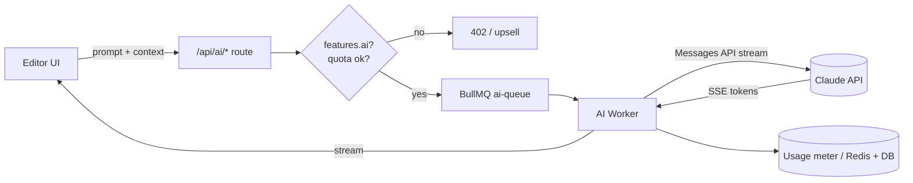

# easy-cms — AI Features

> Document 14 of the easy-cms documentation set. See [README](./README.md) for the full index.

| Field | Value |
|---|---|
| Status | Draft v1.0 |
| Owner | Product / Architecture |
| Last updated | 2026-06-16 |
| Provider | Anthropic Claude API |
| Gating | `features.ai` plan flag (Professional & Agency) |

---

## 1. Overview

AI is an **optional, additive layer** across the product — never a hard dependency
for any core workflow. Every AI tool produces content the user reviews and accepts
into the same data structures (block trees, Tiptap documents, SEO metadata) that the
manual editors write to, so there is no separate "AI content" path to maintain.

All AI features are gated behind the `features.ai` plan flag (see
[13-billing.md](./13-billing.md)) and metered per organization for cost control.

| Tool | Surface | Output target |
|---|---|---|
| AI Blog Writer | Blog editor | Tiptap document (`Post.content`) |
| AI Page Generator | Builder | `BlockNode[]` tree (`Page.content`) |
| AI SEO Suggestions | SEO panel | `SeoMeta` fields |
| AI Image Generation | Media library | `Media` record (uploaded to R2) |
| AI Template Generator | Templates | `TemplateVersion.manifest` |
| AI Content Improvement | Inline (any rich text) | Replacement text/HTML |
| AI FAQ Generator | FAQ section inspector | FAQ items JSON |
| AI Form Generator | Form builder | `FormField[]` |

---

## 2. Architecture



- **Edge route** (`apps/web/src/app/api/ai/*`) authenticates the session, resolves the
  tenant, and checks the `features.ai` flag + remaining quota.
- **Streaming** is proxied straight back to the browser via Server-Sent Events so the
  user sees tokens as they generate (essential UX for long-form writing).
- **Heavy/async jobs** (template generation, batch image generation) are dispatched to
  the `ai-queue` BullMQ worker rather than run inline.
- A thin **`packages/core/ai`** module holds prompt templates and output schemas so
  prompts are versioned and testable in isolation.

### Model selection

| Workload | Default model | Rationale |
|---|---|---|
| Long-form writing, page/template generation | `claude-opus-4-8` | Highest quality structured output |
| Inline improvements, SEO suggestions, FAQ/form gen | `claude-sonnet-4-6` | Faster + cheaper, ample quality |

Models are configured via `AI_DEFAULT_MODEL` and overridable per-tool. Use the latest
Claude models; never hard-code a model id in more than one place — read from config.

---

## 3. Structured output & guardrails

AI tools that write into typed structures (page trees, forms, SEO) **must** return
schema-valid JSON. We use Claude **tool use** with a strict input schema mirroring the
relevant Zod schema, then re-validate with Zod before persisting.

```ts
// packages/core/ai/page-generator.ts (sketch)
import Anthropic from '@anthropic-ai/sdk';
import { pageContentSchema } from '../builder';

const client = new Anthropic();

export async function generatePage(brief: string) {
  const res = await client.messages.create({
    model: process.env.AI_DEFAULT_MODEL ?? 'claude-opus-4-8',
    max_tokens: 8000,
    tools: [{
      name: 'emit_page',
      description: 'Return the page as a block tree.',
      input_schema: PAGE_TREE_JSON_SCHEMA, // mirrors pageContentSchema
    }],
    tool_choice: { type: 'tool', name: 'emit_page' },
    messages: [{ role: 'user', content: buildPrompt(brief) }],
  });

  const block = res.content.find((c) => c.type === 'tool_use');
  // Re-validate before trusting model output.
  return pageContentSchema.parse(block?.input);
}
```

Guardrails:

- **Validate, never trust.** All model output passes through the same Zod schemas as
  human input. Invalid output is retried once, then surfaced as an error.
- **Registry-constrained.** The page generator may only emit `variant`s that exist in
  the component registry; the prompt is injected with the allowed list.
- **Human-in-the-loop.** Generated content lands in a preview/diff the user explicitly
  accepts — nothing is auto-published.
- **Prompt-injection hygiene.** User-supplied content (e.g. "improve this text") is
  passed as data, with system instructions clearly delimited; tool outputs are treated
  as untrusted until validated.
- **No secrets in prompts.** Tenant data sent to the model is limited to what the tool
  needs; PII minimization per [09-security.md](./09-security.md).

---

## 4. Cost controls & metering

| Control | Mechanism |
|---|---|
| Plan gating | `features.ai` flag checked at the route boundary |
| Monthly quota | Per-org token/credit budget tracked in Redis, reconciled to DB |
| Rate limiting | Per-user + per-org limits via the shared rate limiter |
| Max tokens | Per-tool `max_tokens` caps |
| Prompt caching | Claude prompt caching for shared system prompts / registry context |
| Model tiering | Sonnet for cheap tools, Opus only where quality demands it |

Usage is recorded per request (`tool`, `model`, `inputTokens`, `outputTokens`,
`orgId`) and rolled into the billing usage view. When an org exceeds its quota, AI
routes return `402` with an upsell payload; core editing is unaffected.

---

## 5. Per-tool behavior

- **Blog Writer** — inputs: title/outline/tone/length; streams a Tiptap-compatible
  document. Supports "continue", "rewrite section", and outline-first flows.
- **Page Generator** — inputs: business description + page goal; emits a validated
  block tree using only registered sections, then opens it in the builder for editing.
- **SEO Suggestions** — reads page/post content; proposes meta title, description, OG
  tags, and a focus keyword; one-click apply to `SeoMeta`.
- **Image Generation** — text-to-image (via configured image provider); result is
  optimized (WebP) and stored as a normal `Media` record with quota accounting.
- **Template Generator** — async job; produces a multi-page `TemplateVersion.manifest`
  (theme tokens + pages) reviewable before publishing to the marketplace.
- **Content Improvement** — inline action in any rich-text field: shorten, expand, fix
  tone, fix grammar, translate. Returns a diff.
- **FAQ Generator** — given a topic/product, emits Q&A pairs for the FAQ section.
- **Form Generator** — given a description ("contact form with budget dropdown"),
  emits a validated `FormField[]` for the form builder.

---

## Cross-references

- [./06-builder-architecture.md](./06-builder-architecture.md) — block tree the page generator targets.
- [./07-cms-architecture.md](./07-cms-architecture.md) — content structures for the blog writer.
- [./13-billing.md](./13-billing.md) — the `features.ai` flag and quota/metering.
- [./09-security.md](./09-security.md) — prompt-injection and PII handling.
