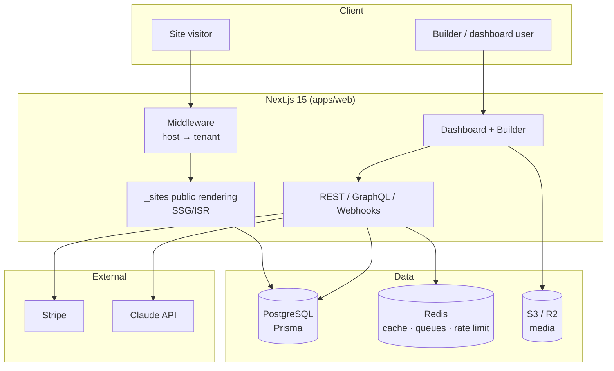

# easy-cms — Documentation

The complete design & architecture set for **easy-cms**, a multi-tenant SaaS
website builder & headless CMS. These documents define the product, the system,
and the build plan; the runnable foundation lives in `apps/` and `packages/`
(see the [root README](../README.md)).

## System at a glance

The platform is one Next.js app serving three surfaces — **marketing**, the
**dashboard/builder**, and **published tenant sites** — separated by host-based
tenant resolution in middleware. Data is a shared PostgreSQL database with
row-level isolation by `organizationId`/`siteId`. See
[02-architecture.md](./02-architecture.md) for the full picture.

## Index

| # | Document | Summary |
|---|---|---|
| 01 | [Product Requirements (PRD)](./01-PRD.md) | Vision, personas, problem, competitive positioning, features, KPIs. |
| 02 | [System Architecture](./02-architecture.md) | App topology, multi-tenancy, request lifecycle, caching, rendering, jobs. |
| 03 | [Database Schema & ERD](./03-database-schema.md) | Full Prisma model set, ERD, indexes, migration & optimization strategy. |
| 04 | [API Design](./04-api-design.md) | REST resources, GraphQL sketch, webhooks, API keys, rate limiting, errors. |
| 05 | [Folder Structure](./05-folder-structure.md) | Annotated monorepo tree and module boundaries. |
| 06 | [Builder Architecture](./06-builder-architecture.md) | Block-tree schema, dnd-kit, editor store, undo/redo, autosave, versioning. |
| 07 | [CMS Architecture](./07-cms-architecture.md) | Collections, dynamic fields, references, content editor, publishing. |
| 08 | [Auth Architecture](./08-auth-architecture.md) | Better Auth, sessions, social login, 2FA, RBAC roles & permission matrix. |
| 09 | [Security](./09-security.md) | Tenant isolation, CSRF, rate limiting, validation, audit, OWASP mitigations. |
| 10 | [Deployment](./10-deployment.md) | Docker, compose, Vercel/Railway/AWS, env vars, CI/CD, migrations, checklist. |
| 11 | [Roadmap](./11-roadmap.md) | MVP scope, Phase 2 & 3, milestones, Gantt. |
| 12 | [Component Library](./12-component-library.md) | Theme tokens, section & component catalogs with supported props. |
| 13 | [Billing](./13-billing.md) | Stripe integration, plans/limits, subscriptions, trials, metering, webhooks. |
| 14 | [AI Features](./14-ai-features.md) | Optional Claude-powered tools, structured output, guardrails, cost controls. |

## Conventions

- **Tech stack** is fixed across all docs: Next.js 15 (App Router) + React 19 +
  TypeScript, TailwindCSS + shadcn/ui, PostgreSQL + Prisma, Better Auth,
  S3/Cloudflare R2, dnd-kit, Tiptap, Zustand, Zod, Redis, Stripe, Claude API.
- **Entity & module names** are shared across documents — `Organization`,
  `Site`, `Page`, `BlockNode`, `Collection`, `Record`, `Plan`, `Subscription`,
  etc. — and match `packages/db/prisma/schema.prisma`.
- **Multi-tenancy** is shared-DB with row-level isolation; every tenant query is
  scoped by `organizationId`/`siteId`.
